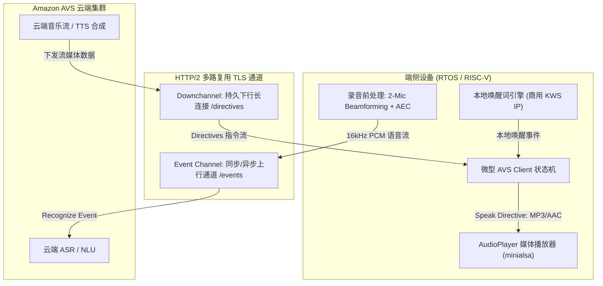
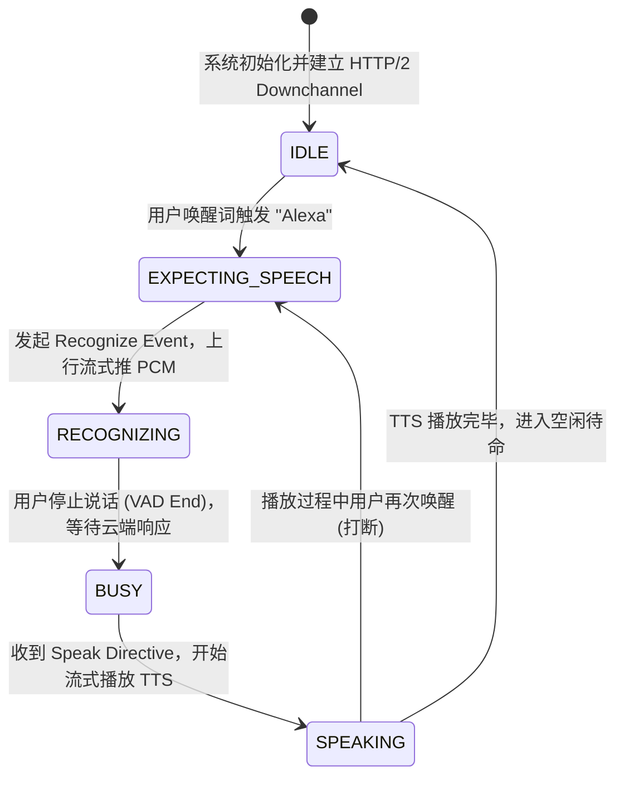
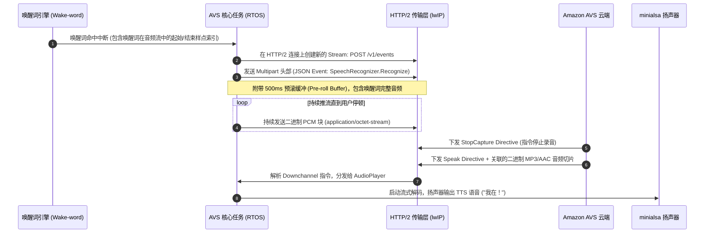

# 04 亚马逊 Alexa (AVS) 协议栈集成与语音唤醒延迟优化

## 1. 为什么 AVS 集成是嵌入式多媒体的终极试金石

亚马逊 **Alexa Voice Service (AVS)** 是全球要求最严苛的消费级语音交互生态之一。为了通过亚马逊官方认证并在 CES 等顶级消费电子展上稳定演示，设备必须严格通过亚马逊官方自动化测试套件（AVS Functional Test Suite）对 **远场唤醒率、误唤醒率（FAR）、唤醒时延（Wakeup Latency）及音频流完整性** 的严苛测试。

在轻量级 RISC-V 芯片上集成 AVS，系统面临巨大的系统工程挑战：
1. **轻量化协议栈落地**：官方开源的 AVS Device SDK（C++ 实现）主要针对 Linux 平台，体积达数十兆字节，需要数百兆内存；在 RTOS MCU 上，必须基于 **HTTP/2 协议库与 JSON 轻量解析器** 自研微型 AVS 客户端。
2. **长连接与双通道多路复用**：AVS 架构要求端侧基于单个持久化 TLS 连接，并行建立 **Downchannel（指令下行通道）** 与 **Events（事件上行通道）**。
3. **毫秒级时延预算管理**：从本地“Alexa”唤醒词检测触发，到云端返回 TTS 响应并开声播放，全链路总时延必须控制在亚秒级内。

---

## 2. AVS 核心微架构与全双工通道设计

---

## 3. AVS 核心状态机与交互时序

---

## 4. 四流全链路分析：Recognize 事件发起与音频流转

当端侧麦克风阵列捕获到用户唤醒词“Alexa”后，系统触发以下时序流：

---

## 5. 软硬件设计约束：亚马逊官方认证的时延与稳定性优化

### 5.1 唤醒响应时延（Wakeup Latency）极限压榨
亚马逊官方规范要求：从用户说出“Alexa”的最后一个音节，到音箱发出“嘟”提示音（Earcon）的时延必须 **$< 500\text{ ms}$**。
* **本地快速响应（Prompt Earcon）**：不在云端下发响应后再播提示音，而是在本地唤醒词判决成立的 **10ms 内**，由端侧本地音频通道直接混音播放一段短 PCM 提示音，极大改善用户的直观反应速度。
* **HTTP/2 连接保活与 Ping-Pong**：移动 WiFi 路由器常在 60 秒无数据后关闭 NAT 映射。端侧必须每隔 30 秒主动发送 `HTTP/2 PING` 帧，确保通道常热，消除建立连接带来的 1.5 秒冷启动延迟。

### 5.2 远场打断回声抑制比（ERLE）要求
当音箱正在播放 $85\text{ dBA}$ 强度的摇滚音乐时，麦克风捡拾到的声音中扬声器回声强度远超用户语音数十倍。
* 系统硬件必须提供 **硬件级回采参考信号（Reference Loopback / Echo Reference）**；
* 软件 AEC 必须具备至少 **$35\text{ dB}$ 的回声消除能力（ERLE）**，确保即使用户在 5 米外轻声说“Alexa”，唤醒词引擎依然能从强回声背景中抽离出干净特征并完成唤醒。

---

## 6. 现场排错与调试清单

| 故障现象 | 调试工具与排查点 | 根本原因分析 | 规避与修复方案 |
| :--- | :--- | :--- | :--- |
| **云端识别频繁返回 `INVALID_REQUEST`** | Wireshark 抓包解密 TLS，比对 Multipart Boundary 格式 | Multipart 请求体中 boundary 结束符缺少标准规范要求的 `--` 结尾 | 严格按照 RFC 2046 规范修正 Multipart MIME 打包器边界填充逻辑 |
| **设备运行数小时后 Downchannel 假死** | 抓取 HTTP/2 状态，检查 TCP Keep-alive 与帧交互 | 路由器 NAT 超时断开连接，但端侧 TCP 协议栈处于半打开状态，未能感知 | 开启应用层主动 Ping 探活，连续 2 次无 ACK 即刻主动重置 TLS 连接并重连 |
| **CES 现场强干扰环境下无法唤醒** | 抓取现场麦克风录音 PCM 数据做频谱分析 | 展馆存在极强低频背景嘈杂噪声（空调、人群），麦克风前置放大器（PGA）过载削波 | 动态调节 AFE PGA 模拟增益，并在软件前处理级开启 150Hz 高通滤波（HPF） |
