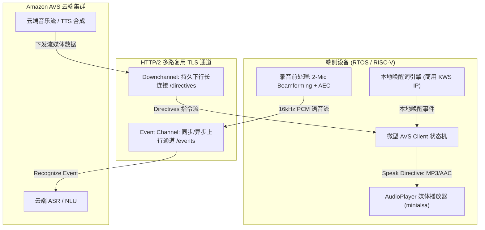
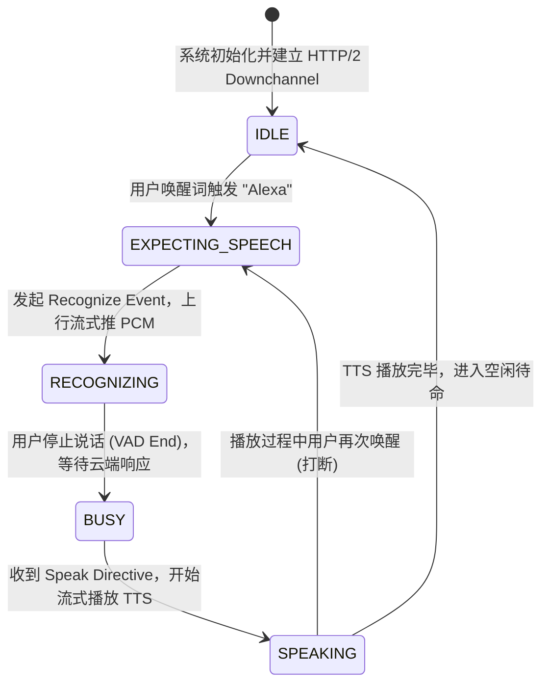
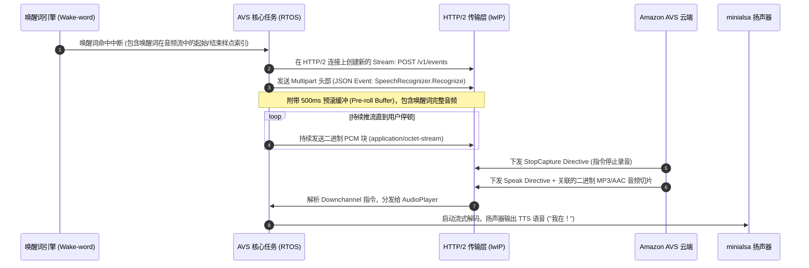

# 04 亚马逊 Alexa (AVS) 协议栈集成与语音唤醒延迟优化

## 1. 为什么 AVS 集成是嵌入式多媒体的终极试金石

集成 **Alexa Voice Service (AVS)** 时，需要同时处理协议状态、音频输入输出和本地唤醒。远场唤醒率、误唤醒率（FAR）、响应时延和音频完整性应分别测试；认证要求与测试套件版本需查对应的官方资料。

在 RISC-V MCU 上，可以按下面几部分评估资源与接口：
1. **客户端依赖**：AVS Device SDK 的依赖和资源占用需按版本与构建配置统计，不能直接把数十兆字节代码、数百兆内存视为所有配置的固定需求。RTOS 上若使用 HTTP/2 库与 JSON 解析器实现客户端，还要核对协议支持范围。
2. **长连接与双通道多路复用**：AVS 架构要求端侧基于单个持久化 TLS 连接，并行建立 **Downchannel（指令下行通道）** 与 **Events（事件上行通道）**。
3. **时延预算**：分别记录本地唤醒提示、上传结束、云端响应和首声播放，避免把不同阶段合成一个无法定位的总数。

---

## 2. AVS 核心微架构与全双工通道设计

```mermaid
graph TD
    subgraph Device["端侧设备 (RTOS / RISC-V)"]
        WWD["本地唤醒词引擎 (商用 KWS IP)"]
        AudioIn[录音前处理: 2-Mic Beamforming + AEC]
        AVS_Client[微型 AVS Client 状态机]
        Player["AudioPlayer 媒体播放器 (minialsa)"]
    end

    subgraph Channel[HTTP/2 多路复用 TLS 通道]
        Down[Downchannel: 持久下行长连接 /directives]
        Event[Event Channel: 同步/异步上行通道 /events]
    end

    subgraph Cloud[Amazon AVS 云端集群]
        CloudASR[云端 ASR / NLU]
        CloudAudio[云端音乐流 / TTS 合成]
    end

    WWD -->|本地唤醒事件| AVS_Client
    AudioIn -->|16kHz PCM 语音流| Event
    Event -->|Recognize Event| CloudASR
    Down -->|Directives 指令流| AVS_Client
    AVS_Client -->|Speak Directive: MP3/AAC| Player
    CloudAudio -->|下发流媒体数据| Down
```

---

## 3. AVS 核心状态机与交互时序

```mermaid
stateDiagram-v2
    [*] --> IDLE : 系统初始化并建立 HTTP/2 Downchannel
    IDLE --> EXPECTING_SPEECH : 用户唤醒词触发 "Alexa"
    EXPECTING_SPEECH --> RECOGNIZING : 发起 Recognize Event，上行流式推 PCM
    RECOGNIZING --> BUSY : 用户停止说话 (VAD End)，等待云端响应
    BUSY --> SPEAKING : 收到 Speak Directive，开始流式播放 TTS
    SPEAKING --> IDLE : TTS 播放完毕，进入空闲待命

    SPEAKING --> EXPECTING_SPEECH : 播放过程中用户再次唤醒 (打断)
```

---

## 4. 四流全链路分析：Recognize 事件发起与音频流转

当端侧麦克风阵列捕获到用户唤醒词“Alexa”后，系统触发以下时序流：

```mermaid
sequenceDiagram
    autonumber
    participant KWS as 唤醒词引擎 (Wake-word)
    participant AVS as AVS 核心任务 (RTOS)
    participant Net as HTTP/2 传输层 (lwIP)
    participant Cloud as Amazon AVS 云端
    participant Sink as minialsa 扬声器

    KWS->>AVS: 唤醒词命中中断 (包含唤醒词在音频流中的起始/结束样点索引)
    AVS->>Net: 在 HTTP/2 连接上创建新的 Stream: POST /v1/events
    AVS->>Net: 发送 Multipart 头部 (JSON Event: SpeechRecognizer.Recognize)
    Note over AVS,Net: 附带 500ms 预滚缓冲 (Pre-roll Buffer)，包含唤醒词完整音频

    loop 持续推流直到用户停顿
        AVS->>Net: 持续发送二进制 PCM 块 (application/octet-stream)
    end

    Cloud->>Net: 下发 StopCapture Directive (指令停止录音)
    Cloud->>Net: 下发 Speak Directive + 关联的二进制 MP3/AAC 音频切片
    Net->>AVS: 解析 Downchannel 指令，分发给 AudioPlayer
    AVS->>Sink: 启动流式解码，扬声器输出 TTS 语音 ("我在！")
```

---

## 5. 软硬件设计约束：亚马逊官方认证的时延与稳定性优化

### 5.1 唤醒响应时延（Wakeup Latency）极限压榨
若本地提示音目标为 **$< 500\text{ ms}$**，需要定义起点和测量方法，并单独核对该产品适用的认证条款。
* **本地提示音（Prompt Earcon）**：可以在本地唤醒判决成立后播放短 PCM 提示音。若目标为 **10ms 内**启动，应检查通道占用、混音和 DMA 排队。
* **HTTP/2 保活**：若测试发现路由器在 60 秒空闲后关闭映射，可评估每 30 秒发送 PING，并验证探测失败与重连逻辑。是否减少 1.5 秒冷启动等待取决于实际连接建立时间，保活不能保证连接始终可用。

### 5.2 远场打断回声抑制比（ERLE）要求
当音箱正在播放 $85\text{ dBA}$ 强度的摇滚音乐时，麦克风捡拾到的声音中扬声器回声强度远超用户语音数十倍。
* 系统硬件必须提供 **硬件级回采参考信号（Reference Loopback / Echo Reference）**；
* 若以 **$35\text{ dB}$ ERLE** 作为目标，应记录播放电平、测量窗口和双讲条件。用户在 5 米外的唤醒效果还取决于噪声、混响、麦克风增益和模型，不能仅凭 ERLE 保证。

---

## 6. 现场排错与调试清单

| 故障现象 | 调试工具与排查点 | 根本原因分析 | 规避与修复方案 |
| :--- | :--- | :--- | :--- |
| **云端识别频繁返回 `INVALID_REQUEST`** | Wireshark 抓包解密 TLS，比对 Multipart Boundary 格式 | Multipart 请求体中 boundary 结束符缺少标准规范要求的 `--` 结尾 | 严格按照 RFC 2046 规范修正 Multipart MIME 打包器边界填充逻辑 |
| **设备运行数小时后 Downchannel 假死** | 抓取 HTTP/2 状态，检查 TCP Keep-alive 与帧交互 | 路由器 NAT 超时断开连接，但端侧 TCP 协议栈处于半打开状态，未能感知 | 开启应用层主动 Ping 探活，连续 2 次无 ACK 即刻主动重置 TLS 连接并重连 |
| **CES 现场强干扰环境下无法唤醒** | 抓取现场麦克风录音 PCM 数据做频谱分析 | 展馆存在极强低频背景嘈杂噪声（空调、人群），麦克风前置放大器（PGA）过载削波 | 动态调节 AFE PGA 模拟增益，并在软件前处理级开启 150Hz 高通滤波（HPF） |
