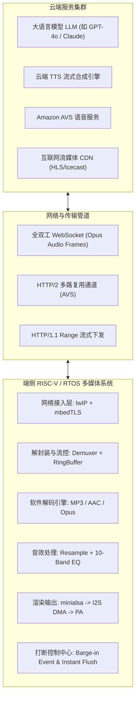

# 13 软件编解码、流媒体与端侧大模型语音 (Audio Codecs, Streaming & Voice AI)

## 1. 模块定位与工程背景

随着 AIoT 与端侧大模型（Edge LLM / Voice Agent）的爆发式发展，嵌入式设备不再仅仅是播放本地铃声的无脑外设，而是演进为兼具 **流媒体多协议兼容、高压缩比有损/无损软解、全双工低时延云端语音交互** 的智能终端。

在这一演进过程中，嵌入式音频工程师面临着更高维度的软件系统工程挑战：
1. **主流软件编解码格式深度掌控**：深入理解 **MP3、AAC (LC/HE/HE-v2)、Opus、Vorbis、FLAC** 的帧结构、心理声学模型与定点解码实现，掌握如何在低主频 MCU 上针对不同格式权衡音质与 CPU/RAM 负载。
2. **多媒体容器解封装与实战排错**：熟练解析 **MP4/M4A、TS、WAV、OGG** 容器格式，攻克网络流媒体边下边播中由 `moov` 尾置、时间戳索引错乱导致的播放失败难题。
3. **网络流媒体协议全覆盖**：支持 **HLS (M3U8)、DASH、PLS、Icecast / Shoutcast** 等互联网广播与流媒体协议，构建高鲁棒性的网络重试与断流抗抖动机制。
4. **端侧大模型流式交互（ChatGPT / Voice Agent）落地**：设计基于 **WebSocket 全双工** 的流式音频链路，实现 TTS 边下边解边播与毫秒级语音打断（Barge-in）清空机制。
5. **国际主流语音平台集成（Amazon AVS）**：通过亚马逊 Alexa 官方认证标准，打通指令/事件全双工通道，实现亚秒级远场唤醒响应。

---

## 2. 模块文档结构

本模块将工业界实战沉淀的编解码库优化、容器解析排错与大模型交互链路系统整理为以下文档：

| 章节序号 | 文档名称 | 核心工程内容 |
| :--- | :--- | :--- |
| **01** | [软件编解码器全家族深度剖析](01-audio-codecs-mp3-aac-opus.md) | MP3 / AAC / Opus 帧结构、霍夫曼与 IMDCT、HE-AAC v1 (SBR) / v2 (PS) 机制与向下兼容原理 |
| **02** | [音频容器解封装与流媒体协议实战](02-container-demuxing-m4a-hls.md) | MP4/M4A Box 树形解析、M4A 无法播放疑难攻坚、HLS (M3U8) / DASH / Icecast 流媒体实战 |
| **03** | [端侧大模型流式语音交互系统](03-chatgpt-websocket-voice-agent.md) | 基于 WebSocket 的 ChatGPT 语音音箱架构、Opus 流式切片、TTS 边下边播与低时延打断 (Barge-in) |
| **04** | [亚马逊 Alexa (AVS) 协议栈集成](04-amazon-avs-voice-service.md) | AVS 协议双通道状态机、远场唤醒时延优化、云端同步与 CES 展会级演示系统设计 |
| **05** | [现场排错与调试案例](05-cases-debug.md) | M4A 索引错乱死循环、WebSocket 音频丢包抖动破音与 AVS 响应超时排查 |
| **06** | [工程推演与量化模型](06-engineering-analysis.md) | 端到端大模型语音交互全链路时延预算推导与 Jitter Buffer 缓冲模型 |

---

## 3. 端到端流式语音与多媒体全景图

