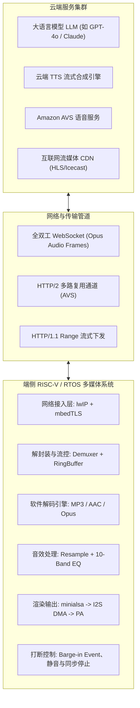

# 13 软件编解码、流媒体与端侧大模型语音 (Audio Codecs, Streaming & Voice AI)

## 1. 模块定位与工程背景

嵌入式音频设备除了本地播放，还可能需要接收网络流媒体、解码压缩音频并处理云端语音交互。这些功能共用有限的 CPU、内存与网络资源。

本章按以下问题整理相关笔记：
1. **编解码格式**：整理 **MP3、AAC (LC/HE/HE-v2)、Opus、Vorbis、FLAC** 的帧结构和解码过程，比较 MCU 上的 CPU、RAM 与音质要求。
2. **容器解析**：说明 **MP4/M4A、TS、WAV、OGG** 的组织方式，排查尾置 `moov`、索引和解析边界问题。
3. **网络播放**：整理 **HLS (M3U8)、DASH、PLS、Icecast / Shoutcast** 等输入方式，以及重试、预取和缓冲策略。
4. **流式语音交互**：设计网络、解码与播放之间的接口，处理语音打断（Barge-in）、取消和资源回收。
5. **国际主流语音平台集成（Amazon AVS）**：整理 Alexa 指令、事件与音频通道的状态关系，以及远场唤醒时延的检查方法。

---

## 2. 模块文档结构

下面分别介绍编解码、容器解析、流媒体和语音交互链路：

| 章节序号 | 文档名称 | 核心工程内容 |
| :--- | :--- | :--- |
| **01** | [软件编解码器全家族深度剖析](01-audio-codecs-mp3-aac-opus.md) | MP3 / AAC / Opus 帧结构、霍夫曼与 IMDCT、HE-AAC v1 (SBR) / v2 (PS) 机制与向下兼容原理 |
| **02** | [音频容器解封装与流媒体协议实战](02-container-demuxing-m4a-hls.md) | MP4/M4A Box 树形解析、M4A 无法播放疑难攻坚、HLS (M3U8) / DASH / Icecast 流媒体实战 |
| **03** | [流式语音交互](03-chatgpt-websocket-voice-agent.md) | 服务协议适配、响应与代际标识、取消状态机及 PCM/DMA 所有权 |
| **04** | [亚马逊 Alexa (AVS) 协议栈集成](04-amazon-avs-voice-service.md) | AVS 协议双通道状态机、远场唤醒时延优化、云端同步与演示系统设计 |
| **05** | [现场排错与调试案例](05-cases-debug.md) | M4A 索引错乱死循环、WebSocket 音频丢包抖动破音与 AVS 响应超时排查 |
| **06** | [工程推演与量化模型](06-engineering-analysis.md) | 端到端大模型语音交互全链路时延预算推导与 Jitter Buffer 缓冲模型 |

---

## 3. 端到端流式语音与多媒体全景图

```mermaid
graph TD
    subgraph Cloud[云端服务集群]
        C1["大语言模型 LLM (如 GPT-4o / Claude)"]
        C2[云端 TTS 流式合成引擎]
        C3[Amazon AVS 语音服务]
        C4["互联网流媒体 CDN (HLS/Icecast)"]
    end

    subgraph Transport[网络与传输管道]
        T1["全双工 WebSocket (Opus Audio Frames)"]
        T2["HTTP/2 多路复用通道 (AVS)"]
        T3[HTTP/1.1 Range 流式下发]
    end

    subgraph Device[端侧 RISC-V / RTOS 多媒体系统]
        D1[网络接入层: lwIP + mbedTLS]
        D2[解封装与流控: Demuxer + RingBuffer]
        D3[软件解码引擎: MP3 / AAC / Opus]
        D4[音效处理: Resample + 10-Band EQ]
        D5[渲染输出: minialsa -> I2S DMA -> PA]
        D6[打断控制: Barge-in Event、静音与同步停止]
    end

    Cloud <--> Transport
    Transport <--> Device
```
