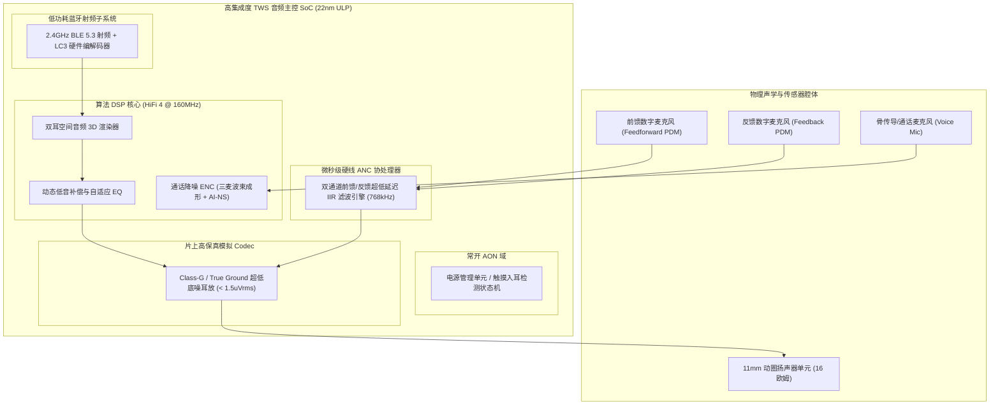

# 全链路案例 1：TWS 降噪耳机端到端软硬件与声学系统设计

## 1. 案例目标与系统指标体系

本案例复盘一款旗舰级真无线主动降噪耳机（TWS ANC Earbuds）的完整芯片与系统工程实现：
- **声学性能**：降噪深度达到 **$42\text{ dB}$**，降噪频宽覆盖 $50\text{ Hz} \sim 3.5\text{ kHz}$；
- **整机延迟**：端到端音频传输延迟控制在 **$< 35\text{ ms}$**（基于 BLE Audio LC3）；
- **电池续航**：单耳 $45\text{ mAh}$ 纽扣电池，在开启 ANC + 音乐连续播放下续航达到 **$7.5\text{ 小时}$**。

---

## 2. 全链路系统架构 Block Diagram

---

## 3. 核心技术攻坚点：下行音乐补偿与 ANC 叠加防削波

当耳机同时开启强力降噪并播放大音量重低音摇滚乐时：
- 反馈降噪回路会把音乐中的超低音也误当做耳道内的“低频噪声”进行反向相消！
- **解决方案**：在 DSP 内部建立**音乐自抵消补偿滤波器（Music Cancellation Filter）**，将音乐信号预先进行声学传递函数建模，从反馈麦克风采样中扣除，使得降噪环路“对音乐视而不见”。
- **防削波策略**：反相声波与大音量音乐在 DAC 端叠加可能突破 $0\text{ dBFS}$ 满量程。必须配备片上微秒级前瞻限幅器（Look-ahead Limiter），在不产生爆音的前提下平滑压低增益。
