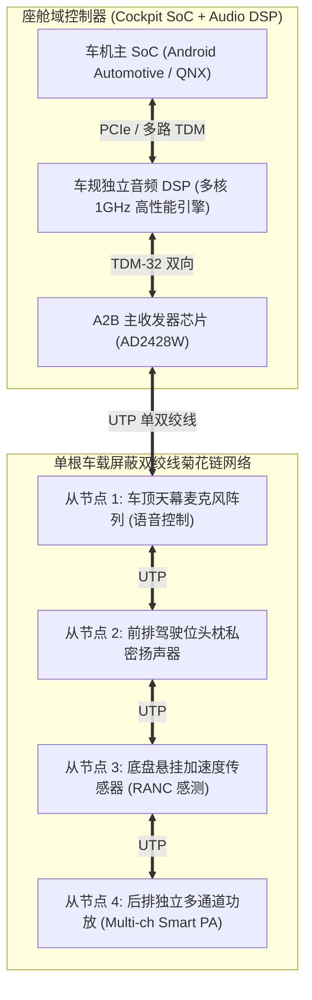

# 全链路案例 2：智能座舱多音区 A2B 与 DSP 音频引擎架构推演

## 1. 案例目标与整车声学挑战

本案例解析现代化高端智能电动汽车（7 座 SUV）全车 24 扬声器、8 麦克风的智能座舱声学系统设计：
1. **独立四音区互不干扰（4-Zone Independent Audio）**：主驾导航、副驾看电影、后排左右乘客分别打游戏听歌，声场物理隔离度要求 $> 18\text{ dB}$；
2. **主动道路降噪（RANC）**：利用底盘 4 个车轮处的加速度计，提前采集路面颠簸振动，在车厢扬声器发出反相声波消除低频路噪（$50\text{ Hz} \sim 250\text{ Hz}$）；
3. **引擎声浪合成（ESE）**：跟随加速踏板开度与电机转速实时合成澎湃的超跑声浪。

---

## 2. 车规级网络拓扑与信号路由

---

## 3. 四音区声场物理隔离算法实现

要实现前后排声音互不干扰，单纯调小音量无法解决声波的空间绕射。系统采用**基于扬声器阵列的声学暗区控制（Acoustic Contrast Control, ACC）**：
- 在主驾座椅头枕内嵌入双扬声器，构建近耳偶极子（Dipole）反向声场；
- 空间声波在副驾位置相干抵消，在副驾区域形成深度达 $20\text{ dB}$ 的“声学阴影区（Acoustic Dark Zone）”，完美达成四人四音区私密聆听。
