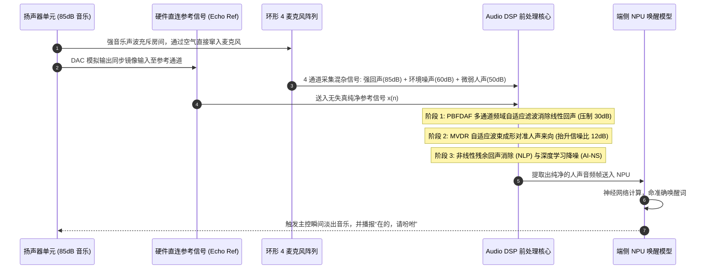

# 全链路案例 3：智能音箱 4 麦远场拾音、AEC 回声消除与语音唤醒全流程

## 1. 案例目标与工程背景

复盘一款支持全双工语音交互的智能家居中控音箱：
- 在自身以 $85\text{ dB SPL}$ 大音量播放音乐的同时，能够灵敏响应 5 米外轻声发出的唤醒词；
- 支持随时插话打断（Barge-in）；
- 硬件物料成本（BOM）控制在极低水平。

---

## 2. 硬件拓扑与全流程时序图

---

## 3. 关键自测实操技巧

- **消音室基准测试**：先在全消音室测量扬声器到麦克风的物理脉冲响应，确认回声路径线性度（THD 是否满足要求）；
- **动态延迟校准**：通过在播放音乐前打入一个不可闻的微弱单脉冲（Diracs Pulse），自动测量并锁定整机声学群延迟。
