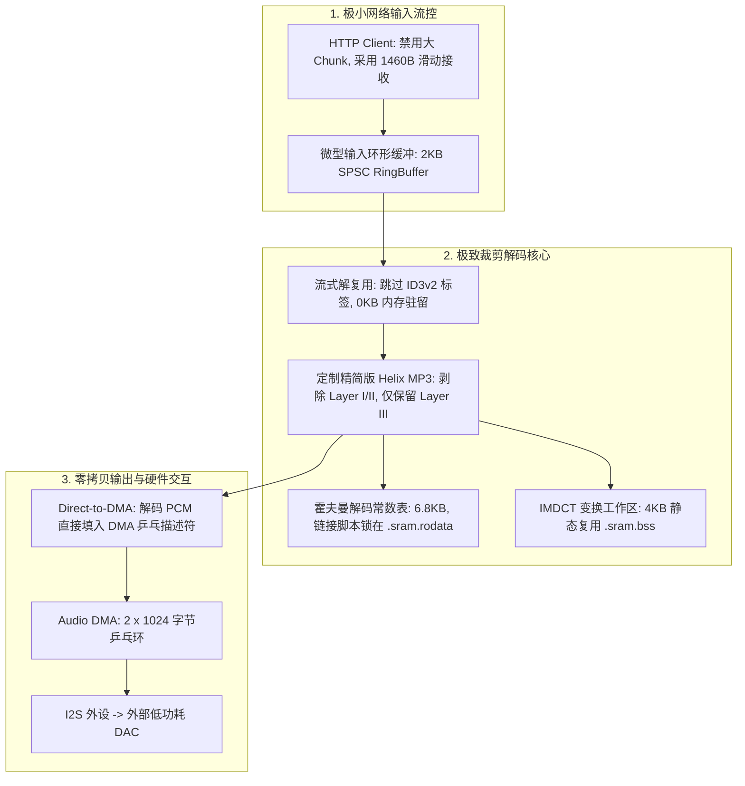

# 04 RISC-V 极受限内存（<256KB RAM）智能音箱多媒体播放器落地实战

## 1. 案例背景与商业挑战

在智能家居音频 SoC（RISC-V 架构）产品化落地过程中，芯片面临严苛的物料成本（BOM）与存储限制：
* **片内高速 SRAM** 仅有 **384 KB**，且未外挂昂贵的 DDR/PSRAM；
* **并发业务极重**：芯片需要同时运行 **WiFi 6 协议栈**（独占 160KB 用于 TCP/UDP 发送/接收环与驱动描述符）、**FreeRTOS 内核与应用管理**（40KB）、**mbedTLS 加密库**（30KB）；
* **核心挑战**：留给整个多媒体音频子系统（网络接收 + 解复用 + MP3/AAC 解码 + minialsa 驱动 + DMA）的 **RAM 预算必须被死死锁在 50 KB 以内**！

如果采用常规开源方案，单 MP3 解码运行态即需 120KB，系统将瞬间 OOM 崩溃。

---

## 2. 软硬件协同全栈架构设计

---

## 3. 核心技术攻坚手段

### 3.1 解码器内存开销由 120KB 到 45KB 的五步裁剪法
1. **输入缓冲（Input Buffer）裁剪（32KB $\to$ 2KB）**：摒弃整帧预加载机制，基于自研的 `spsc_ringbuffer` 实现按需喂入，滑动窗口收缩至 2048 字节；
2. **输出缓冲（PCM Buffer）归零（16KB $\to$ 0KB）**：取消解码器内部独立的 PCM 暂存数组，使解码核心直接将样点写入 minialsa 提供的空闲 DMA 物理缓冲（Zero-Copy Direct Render）；
3. **结构体冗余剔除（28KB $\to$ 14KB）**：全面梳理解码器 Context，剔除 Layer I/II 代码、未使用的立体声中间态矩阵及复杂错误掩盖历史帧缓冲；
4. **ID3 标签流式跳过（16KB $\to$ 0KB）**：重构头部状态机，读取 10 字节头后利用文件 `seek` 或流丢弃跳过数万字节的专辑图片，元数据内存开销归零；
5. **任务栈深度极致优化（16KB $\to$ 4KB）**：将解码函数中的大数组局部变量全部剥离出栈，转为静态全局复用工作区，严格控制函数调用深度不超过 6 层。

### 3.2 动态抗抖动与 WiFi 吞吐共存策略
在 WiFi 出现射频信道干扰、重传率上升时，WiFi 任务将消耗大量 CPU。为了防止音频 DMA 出现欠载：
* 音频解码任务优先级设置为高于 WiFi 接收任务；
* 引入 **微秒级让渡机制**：音频任务每解码完 1 个 MP3 帧（耗时约 $1.2\text{ ms}$，对应发声时间 $26.1\text{ ms}$），主动 `vTaskDelay(1)` 挂起，将 CPU 完全出让给 WiFi 协议栈收发网络包；
* 在这种精密的时序交织下，实现了单核 CPU 在 160MHz 主频下，WiFi 吞吐跑满 40Mbps 的同时，音频播放保持 100% 零丢帧。

---

## 4. 落地成果与商业指标

* **内存压减成果**：音频子系统运行时总内存稳定在 **45.3 KB**，整机 SRAM 盈余超过 **50 KB**，系统再无 OOM 隐患；
* **CPU 负载**：MP3 解码整机 CPU 占用率稳定在 **7.8%**；
* **量产检验**：成功通过 **20kk（两千万台）级别** 智能家居与智能家电订单的严苛高低温、弱网稳定性验收测试，成为该芯片原厂多媒体 SDK 的标杆级参考设计。
