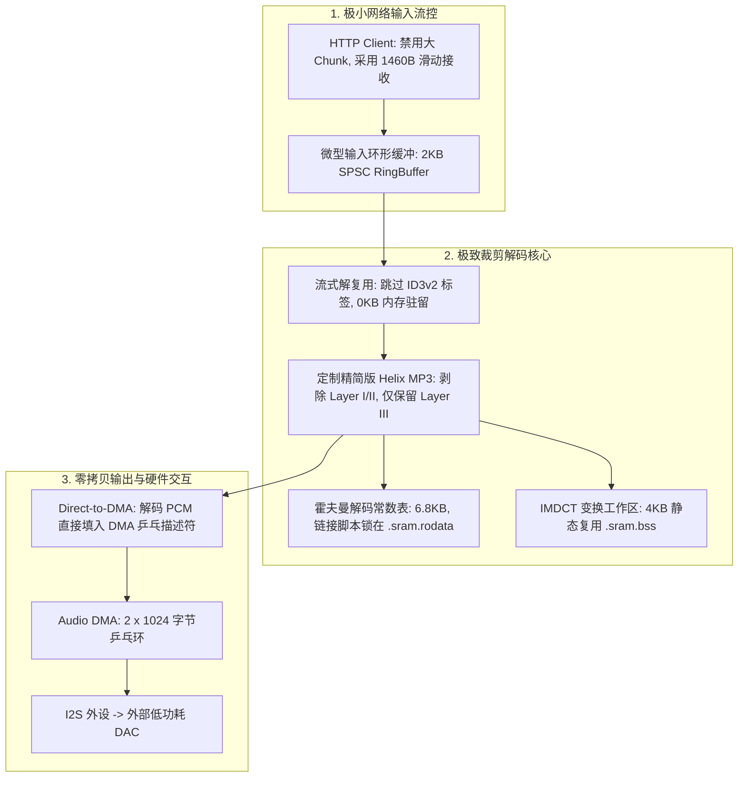

# 04 RISC-V 极受限内存（<256KB RAM）智能音箱多媒体播放器落地实战

## 1. 案例背景与商业挑战

本案例按以下 RISC-V 音频 SoC 配置讨论内存与并发调度；所列内存、吞吐和 CPU 数据用于说明分析过程，不能作为其他芯片或解码器配置的保证：
* **片内高速 SRAM** 仅有 **384 KB**，且未外挂昂贵的 DDR/PSRAM；
* **并发业务极重**：芯片需要同时运行 **WiFi 6 协议栈**（独占 160KB 用于 TCP/UDP 发送/接收环与驱动描述符）、**FreeRTOS 内核与应用管理**（40KB）、**mbedTLS 加密库**（30KB）；
* **音频预算**：为网络接收、解复用、MP3/AAC 解码、minialsa 驱动与 DMA 分配 **50 KB 以内的 RAM**。

若所选 MP3 解码器配置占用 120KB，就会超出这份音频预算；应先通过链接映射、堆峰值和任务栈水位确认占用，开源解码器的需求并不固定为同一数值。

---

## 2. 软硬件协同全栈架构设计

```mermaid
graph TD
    subgraph NetLayer[1. 极小网络输入流控]
        HTTP[HTTP Client: 禁用大 Chunk, 采用 1460B 滑动接收]
        RingIn[微型输入环形缓冲: 2KB SPSC RingBuffer]
    end

    subgraph CoreLayer[2. 极致裁剪解码核心]
        Demux[流式解复用: 跳过 ID3v2 标签, 0KB 内存驻留]
        Dec[定制精简版 Helix MP3: 剥除 Layer I/II, 仅保留 Layer III]
        Table[霍夫曼解码常数表: 6.8KB, 链接脚本锁在 .sram.rodata]
        IMDCT[IMDCT 变换工作区: 4KB 静态复用 .sram.bss]
    end

    subgraph RenderLayer[3. 零拷贝输出与硬件交互]
        ZeroCopy[Direct-to-DMA: 解码 PCM 直接填入 DMA 乒乓描述符]
        DMA[Audio DMA: 2 x 1024 字节乒乓环]
        I2S[I2S 外设 -> 外部低功耗 DAC]
    end

    HTTP --> RingIn
    RingIn --> Demux
    Demux --> Dec
    Dec --> Table
    Dec --> IMDCT
    Dec --> ZeroCopy
    ZeroCopy --> DMA
    DMA --> I2S
```

---

## 3. 核心技术攻坚手段

### 3.1 解码器内存开销由 120KB 到 45KB 的五步裁剪法
1. **输入缓冲（Input Buffer）裁剪（32KB $\to$ 2KB）**：摒弃整帧预加载机制，基于自研的 `spsc_ringbuffer` 实现按需喂入，滑动窗口收缩至 2048 字节；
2. **输出缓冲（PCM Buffer）归零（16KB $\to$ 0KB）**：取消解码器内部独立的 PCM 暂存数组，使解码核心直接将样点写入 minialsa 提供的空闲 DMA 物理缓冲（Zero-Copy Direct Render）；
3. **结构体冗余剔除（28KB $\to$ 14KB）**：全面梳理解码器 Context，剔除 Layer I/II 代码、未使用的立体声中间态矩阵及复杂错误掩盖历史帧缓冲；
4. **ID3 标签流式跳过（16KB $\to$ 0KB）**：重构头部状态机，读取 10 字节头后利用文件 `seek` 或流丢弃跳过数万字节的专辑图片，元数据内存开销归零；
5. **任务栈优化（16KB $\to$ 4KB）**：将可复用的大数组移出栈，结合调用路径、递归与中断嵌套测量栈水位。这里以调用深度不超过 6 层为约束；静态工作区还需保证并发访问安全。

### 3.2 动态抗抖动与 WiFi 吞吐共存策略
在 WiFi 出现射频信道干扰、重传率上升时，WiFi 任务将消耗大量 CPU。为了防止音频 DMA 出现欠载：
* 音频解码任务优先级设置为高于 WiFi 接收任务；
* 引入 **微秒级让渡机制**：音频任务每解码完 1 个 MP3 帧（耗时约 $1.2\text{ ms}$，对应发声时间 $26.1\text{ ms}$），主动 `vTaskDelay(1)` 挂起，将 CPU 完全出让给 WiFi 协议栈收发网络包；
* 若在 160MHz 下同时测得 WiFi 吞吐 40Mbps、音频测试区间内丢帧数为零，应注明码流、网络负载和测试时长。该结果不能保证所有干扰、重传和业务组合都不丢帧。

---

## 4. 落地成果与商业指标

* **内存核算**：按本例统计，音频运行时占用 **45.3 KB**、整机 SRAM 余量超过 **50 KB**。仍需覆盖错误恢复、并发连接和任务栈峰值，余量不等于消除 OOM 风险；
* **CPU 负载**：本例给出的 MP3 解码 CPU 占用率为 **7.8%**，需要注明统计窗口、码流与测量范围；
* **量产检验范围**：**20kk（两千万台）**订单规模本身不能说明高低温或弱网测试覆盖充分。评估参考设计时，应查看实际测试条件、样本与失效记录。
