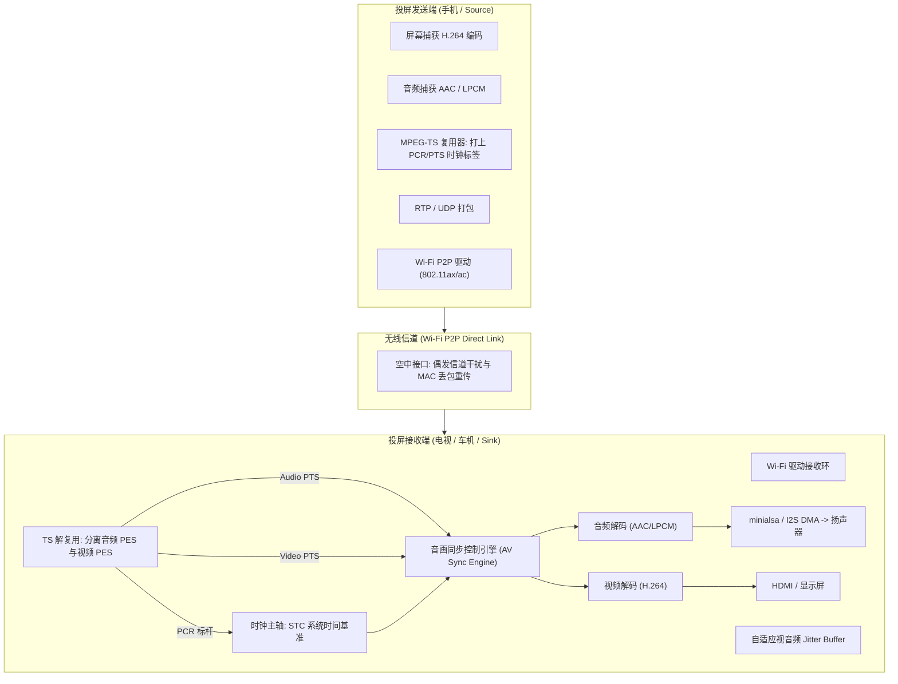
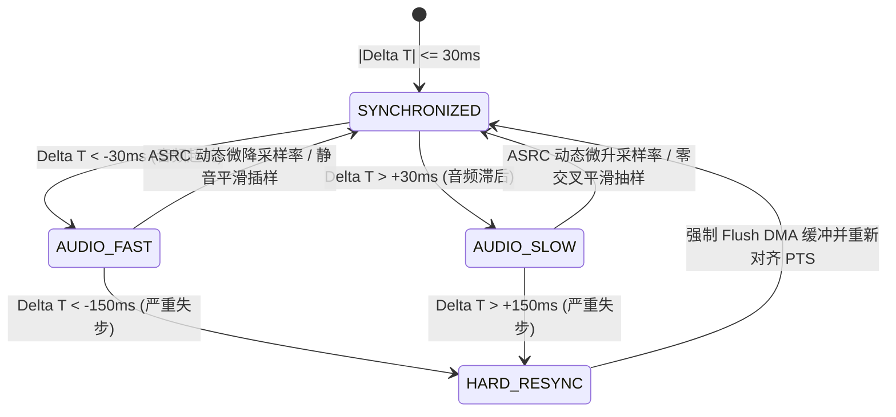

# 05 Wi-Fi 投屏 Miracast (Wi-Fi Display) 音画同步与网络抗抖动实战

## 1. 案例背景与投屏场景的声学痛点

在电视大屏与车载投屏项目（电视大屏、车载车机对接主流安卓手机）中，**Wi-Fi 投屏（Miracast / Wi-Fi Display, WFD）** 是最具挑战性的无线视音频传输场景之一。

与互联网视频点播（VoD）允许缓存数秒数据不同，无线投屏属于 **极低时延交互场景（要求端到端时延 $< 150\text{ ms}$）**。在复杂的家庭无线环境中，WiFi 信道争抢、同频干扰与多径衰落极其普遍。这给音频子系统带来了双重严峻考验：
1. **音画不同步（AV Desync / Lip-sync Issue）**：视频数据量极大（1080p/60fps H.264 码率达 10~20Mbps，单个 I 帧跨越数十个 WiFi 分片），在 WiFi 发生丢包重传时，视频往往发生数十至数百毫秒的排队拥塞；而音频数据包小（AAC/LPCM 仅需数百字节），极快穿透网络到达。若接收端简单按“即收即解即播”，就会出现“声音已出，画面卡在 1 秒前”的严重脱节；
2. **Wi-Fi 重传抖动引发的音频撕裂破音**：当 WiFi 发生突发丢包重传（MAC 层重传消耗 30~50ms）时，音频接收队列发生瞬间下溢（Underflow），扬声器产生刺耳的“嘎哒”破音。

---

## 2. Miracast 视音频传输协议微架构

---

## 3. 音画同步（AV Sync）数学模型与时钟恢复

在 MPEG-TS 传输流规范中，音画同步依赖三个核心时钟标记：
* **PCR（Program Clock Reference，节目时钟参考）**：发送端 27MHz 高精晶振生成的系统参考时钟，用于接收端恢复本地主时钟（STC）；
* **PTS（Presentation Time Stamp，显示时间戳）**：音视频帧被送入显示屏或 DAC 渲染发声的绝对时刻（90kHz 计数基准）；
* **DTS（Decoding Time Stamp，解码时间戳）**：音视频帧送入解码器解码的时刻。

### 3.1 人耳听觉对音唇同步（Lip-sync）的感知容限
根据 ITU-R BT.1359-1 国际标准建议书：
* **音频提前画面（Audio leads Video）**：容限仅为 **$-20\text{ ms} \sim -45\text{ ms}$**（人耳对声音先于画面极其敏感，易察觉突兀）；
* **音频滞后画面（Audio lags Video）**：容限较宽，为 **$+40\text{ ms} \sim +125\text{ ms}$**（符合光速大于声速的自然物理常识）。

### 3.2 音频从轴（Audio-Slave）与变速微调算法
在嵌入式投屏方案中，通常采用 **以视频为主轴、音频动态微调对齐** 的策略：

设第 $k$ 帧音频的理想显示时间为 $\text{PTS}_a(k)$，当前系统视频渲染主轴时钟为 $\text{STC}_v$。定义音画相位误差：
$$\Delta T = \text{PTS}_a(k) - \text{STC}_v$$

---

## 4. 软硬件协同设计：对抗 Wi-Fi 抖动的自适应音频缓冲

为解决 WiFi 重传引起的瞬间音频欠载（Underrun），在驱动与多媒体层之间部署 **自适应弹性 Jitter Buffer**：
1. **动态水位调控**：在 WiFi 握手与连接初期，驱动层向音频栈上报当前无线信道的 MCS 索引与重传率（Retransmit Count）。当 WiFi 链路恶化时，Jitter Buffer 深度自动由 40ms 平滑拉升至 80ms，为 MAC 层的退避重传提供充分的安全缓冲垫；
2. **零交叉点插入/删除（Zero-Crossing Sample Insertion/Deletion）**：
   * 当不得不进行音频缓冲拉伸或压缩时，**严禁生硬丢弃 PCM 采样点**（否则会产生高频相位断裂跳变，形成爆音）；
   * 算法实时搜索 PCM 波形的 **零交叉点（Zero-crossing Point）**，在波形过零处平滑复制一个微小周期（微调变慢）或删除一个微小周期（微调变快），实现有损的时长微调；是否可察觉取决于信号、插删频率和处理算法，必须验证听感与频谱。

---

## 5. 验证计划与证据边界

本案例未附原始测试记录，不声明客户验收、ITU-R 认证或量产成绩。验证时分别记录连接成功率的样本数、两小时音画偏差轨迹、丢包模型（随机/突发）、jitter 分布和输出 gap。容限应按具体业务及适用规范设定；不存在从单个 ±25 ms 数字即可推导的通用“金标认证”。

过零点插删样仍会改变信号，不保证无损或完全不可察觉。用受控的重采样/时间伸缩策略并验证听感、频谱和同步稳定性，不能以过零替代完整音质验证。
