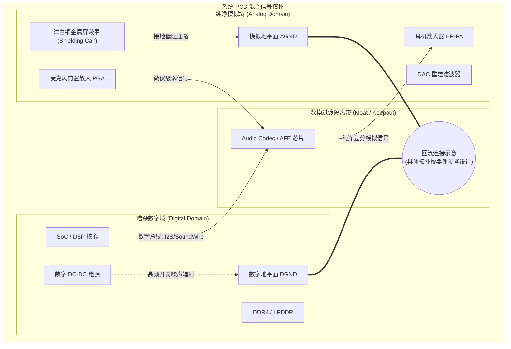

# 横向专题 1：模拟混合信号隔离与 PCB 布局法则

## 1. 核心工程问题与物理背景

在现代音频 SoC、智能座舱车机以及高端便携式 Hi-Fi 播放器中，**数模混合信号（Mixed-Signal）共存**是硬件声学工程中最棘手的系统级挑战：

1. **极端动态范围对比**：
   - 麦克风输入端的弱模拟信号仅为微伏（$\mu\text{V}$）级别（例如 $-60\text{ dBV} \approx 1\text{ mV}_{\text{rms}}$，高保真微弱底噪甚至低于 $1\sim 2\ \mu\text{V}$）；
   - 片上数字 CPU、DDR 内存总线与 GPU 核心在几百兆至数吉赫兹（GHz）高频开关，瞬态电流跳变速率 $\frac{di}{dt}$ 往往高达 $10^9\text{ A/s}$；
   - D 类功率放大器（Class-D PA）以 $300\text{ kHz} \sim 2.1\text{ MHz}$ 的载波频率直接开关驱动数安培的扬声器瞬态电流。
2. **地弹与串扰机制**：
   数字返回电流如果流经模拟敏感地的公共阻抗（Common Impedance），将直接根据 $V_{\text{bounce}} = L \frac{di}{dt}$ 在模拟地平面产生毫伏级的地弹电压，导致音频输出出现可闻的尖锐杂音（高频“滋滋”声、蜂窝射频 TDMA 脉冲“嗒嗒”声或底噪 Hiss）。

本专题系统归纳芯片原厂与高端音频硬件板级的**抗干扰设计拓扑、PCB 叠层方案与原厂布局十项检查**。

---

## 2. 混合信号分区与地平面拓扑架构

---

## 3. 原厂 PCB 布局十项检查与物理机理

### 检查 1：布局分区不等于地平面分割

把时钟、开关电源和大电流回路远离敏感输入；不存在适用于所有板卡的 15 mm 安全距离。近场电容、电感耦合与回流路径不能统一用场强距离平方反比解释。

### 检查 2：根据器件参考设计选择接地拓扑

优先评估连续低阻抗地平面与合理布局。AGND/DGND 的名称不构成全板开槽的理由；EPAD 功能、接地过孔和连接位置必须查目标器件资料。图中的分区是功能示意，不是 PCB 开槽指令。不得任意串入磁珠隔断高频回流。

[Analog Devices 接地说明](https://www.analog.com/en/resources/faqs/faq_dds_digital_and_analog_gnd_planes.html)也强调共同低阻抗地平面的适用性。外部设备连接造成的地环路需独立分析，不能承诺一个星点消除所有嗡声。

### 检查 3：保持参考平面连续

避免高速走线跨地缝；换层时提供相邻参考回流过孔。高频回流趋向低阻抗路径，断槽会增加环路面积和耦合。若系统必须分区，跨区接口及回流桥需一起评审。

### 检查 4：差分模拟输入按阻抗和带宽设计

保持两路寄生和滤波网络对称，控制与干扰源的耦合。模拟 MIC 输入没有通用的 100 Ω 差分阻抗或 0.2 mm 等长要求；应依据源阻抗、输入电容、带宽与 CMRR 预算。差分结构只能抑制其能力范围内的共模噪声，不能消除已经转为差模的干扰。

### 检查 5：多层板“内层夹心”带状线走线（Stripline Shielding）
- **推荐叠层（6层板典型方案）**：
  - Layer 1（Top）：元器件放置与局部出线；
  - **Layer 2（GND1）**：完整无缺口的连续地平面（通过器件布局控制模拟与数字回流）；
  - **Layer 3（Signal Inner）**：敏感模拟走线层（麦克风、DAC 重建输出）；
  - **Layer 4（Power / GND2）**：模拟电源平面（AVDD）与完整第二地层；
  - Layer 5（Signal Inner）：高速数字总线（DDR/I2S/SDIO）；
  - Layer 6（Bottom）：辅助地铜皮与 Class-D 扬声器功率输出走线。
- **物理机理**：敏感信号位于 Layer 3，上下被 Layer 2 和 Layer 4 完整地平面夹持，形成三维法拉第笼（Stripline 结构），外界空间高频辐射衰减达 $40\text{ dB}$ 以上。

### 检查 6：音频时钟线 3W 原则与伴地过孔屏蔽（Grounded Coplanar Waveguide）
- **拓扑要求**：主时钟（MCLK）、位时钟（BCLK）必须遵循 **3W 原则**（走线间距大于走线宽度的 3 倍）。在时钟线两侧铺设伴地铜皮，并**每隔 $2\sim 3\text{ mm}$ 打一个过孔直通地平面**。
- **物理机理**：伴地过孔间距需满足远小于时钟高次谐波波长的二十分之一（$d < \frac{\lambda_{3\text{rd}}}{20}$），防止边缘电磁场向外横向泄漏，杜绝高频时钟能量耦合进相邻的音频模拟走线。

### 检查 7：参考基准电容（VREF / VCM）零距离放置
- **拓扑要求**：AFE 核心电压基准引脚（VREF / VCM / VMID）的退耦滤波电容（通常为 $10\ \mu\text{F} + 0.1\ \mu\text{F}$ 陶瓷电容）必须紧贴芯片引脚放置，走线长度控制在 **$< 1.0\text{ mm}$**，且过孔直接打入芯片下方的 AGND。
- **物理机理**：VREF 是 Sigma-Delta ADC 内部量化对比的“基准尺”。如果该引脚存在哪怕 $1\text{ mV}$ 的高频纹波，该纹波将直接乘入整个音频频带，摧毁 ADC 的 SNR 与动态范围。

### 检查 8：D 类功放（Class-D PA）大电流环路极小化
- **拓扑要求**：Class-D 功率输出端（OUT_P、OUT_N）到扬声器接插件的走线必须粗而短（线宽 $\ge 1.0\text{ mm}$），LC 滤波电路（如有）的电感与电容应在同层紧贴芯片放置。
- **物理机理**：Class-D 输出为纳秒级方波大电流。极小化走线电感 $L = \mu_0 \mu_r \frac{l}{w}$ 与回路面积，不仅可以消除尖峰过冲保护 MOSFET，还能避免该方波在整块 PCB 上形成广播天线。

### 检查 9：洋白铜屏蔽罩（Shielding Can）无缝密封
- **拓扑要求**：在带有蜂窝 4G/5G、Wi-Fi/BT 射频天线的设备（智能手机、车机、智能音箱）中，AFE 模拟电路与 Codec 必须加盖整体洋白铜屏蔽罩，屏蔽罩边缘接地焊盘间距 $< 2.5\text{ mm}$。
- **物理机理**：GSM 蜂窝通信的 $217\text{ Hz}$ TDMA 突发脉冲功率高达 2W（$+33\text{ dBm}$），空间辐射会直接穿透硅片或由 PCB 走线感应并被微弱 PN 结整流为音频嗡鸣声。屏蔽罩提供物理衰减阻隔。

### 检查 10：模拟电源专属低噪声 LDO 供电与 $\pi$ 型滤波
- **拓扑要求**：禁止将 SoC 的系统 DC-DC（例如 3.3V / 1.8V）直接供给 Codec 的 AVDD。必须在模拟域前级级联一颗超高电源抑制比（PSRR $> 70\text{ dB} @ 100\text{ kHz}$）的专属低噪声 LDO，并在输入输出端构建 **磁珠（Ferrite Bead） + 陶瓷电容构成的 $\pi$ 型滤波网络**。
- **物理机理**：DC-DC 开关频率（通常在 $1.5\text{ MHz} \sim 3\text{ MHz}$）具有丰富的次谐波与高频毛刺，普通电源滤波电容在此频段因寄生等效串联电感（ESL）已呈现感性，磁珠的高频损耗特性可将高频纹波耗散为热能。

---

## 4. 现场排查与调试清单（Triage Checklist）

| 异常现象 | 物理根因排查方向 | 原厂整改建议 |
| :--- | :--- | :--- |
| **无播放时耳机有持续“沙沙”底噪（Hiss）** | 模拟地受到数字地回路污染，或 AVDD 纹波超标 | 1. 检查单点接地桥是否开裂； 2. 示波器交流耦合探头测量 VREF 纹波，更换超低噪声 LDO。 |
| **播放伴随固定频率啸叫（如 1kHz 谐波）** | 时钟线（BCLK/MCLK）对模拟输入线产生容性近场耦合 | 1. 割断并重新飞线，增加空间间距； 2. 补打伴地屏蔽过孔；走线增加 RC 终端阻尼电阻。 |
| **通话时偶现周期性“嗒嗒”脉冲杂音** | 蜂窝 2G/4G/5G 射频功率放大器 TDMA 辐射整流 | 1. 模拟输入端对地并联 $10\sim 33\text{ pF}$ 射频旁路电容； 2. 检查屏蔽罩接地是否虚焊。 |
| **音量调大时输出剧烈破音且系统复位** | Class-D 瞬态大电流引发电源跌落（Brownout）与地弹 | 1. 加粗 PVDD 走线，就近并联 $100\ \mu\text{F}$ 钽电容； 2. 确保 PA 地回路直接回流至主滤波电容。 |
