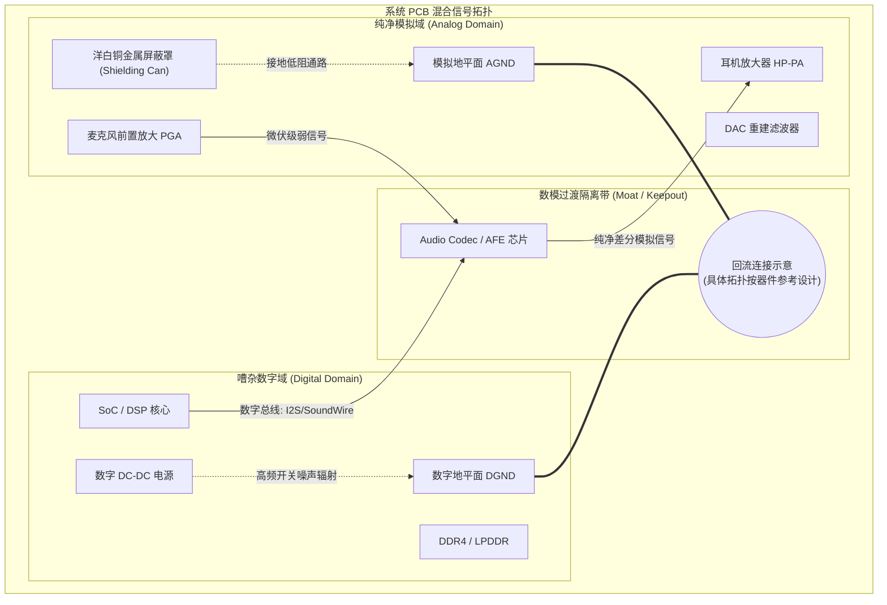

# 横向专题 1：模拟混合信号隔离与 PCB 布局法则

## 1. 核心工程问题与物理背景

音频 SoC、车机和便携播放器中的模拟输入与数字开关电路共存，需要关注信号幅度、回流路径和干扰耦合：

1. **极端动态范围对比**：
   - 麦克风输入端的弱模拟信号仅为微伏（$\mu\text{V}$）级别（例如 $-60\text{ dBV} \approx 1\text{ mV}_{\text{rms}}$，高保真微弱底噪甚至低于 $1\sim 2\ \mu\text{V}$）；
   - 片上数字 CPU、DDR 内存总线与 GPU 核心在几百兆至数吉赫兹（GHz）高频开关，瞬态电流跳变速率 $\frac{di}{dt}$ 往往高达 $10^9\text{ A/s}$；
   - D 类功率放大器（Class-D PA）以 $300\text{ kHz} \sim 2.1\text{ MHz}$ 的载波频率直接开关驱动数安培的扬声器瞬态电流。
2. **地弹与串扰机制**：
   数字返回电流如果流经模拟敏感地的公共阻抗（Common Impedance），将直接根据 $V_{\text{bounce}} = L \frac{di}{dt}$ 在模拟地平面产生毫伏级的地弹电压，导致音频输出出现可闻的尖锐杂音（高频“滋滋”声、蜂窝射频 TDMA 脉冲“嗒嗒”声或底噪 Hiss）。

下面整理分区、叠层、时钟、电源和输出回路的检查项。给出的尺寸与器件参数需要结合板层结构、信号频谱和器件参考设计评估。

---

## 2. 混合信号分区与地平面拓扑架构

```mermaid
graph TB
    subgraph PCB["系统 PCB 混合信号拓扑"]
        subgraph DigitalArea["嘈杂数字域 (Digital Domain)"]
            CPU[SoC / DSP 核心]
            DDR[DDR4 / LPDDR]
            PMIC_D[数字 DC-DC 电源]
            DGND[数字地平面 DGND]
        end

        subgraph CodecArea["数模过渡隔离带 (Moat / Keepout)"]
            Codec["Audio Codec / AFE 芯片"]
            StarPoint(("回流连接示意<br/>(具体拓扑按器件参考设计)"))
        end

        subgraph AnalogArea["纯净模拟域 (Analog Domain)"]
            MicAFE[麦克风前置放大 PGA]
            DAC_LPF[DAC 重建滤波器]
            HeadphonePA[耳机放大器 HP-PA]
            AGND[模拟地平面 AGND]
            Shield["洋白铜金属屏蔽罩 (Shielding Can)"]
        end
    end

    CPU -->|数字总线: I2S/SoundWire| Codec
    PMIC_D -.->|高频开关噪声辐射| DGND
    Codec -->|纯净差分模拟信号| HeadphonePA
    MicAFE -->|微伏级弱信号| Codec

    DGND === StarPoint
    AGND === StarPoint
    Shield -.->|接地低阻通路| AGND
```

---

## 3. 原厂 PCB 布局十项检查与物理机理

### 检查 1：布局分区不等于地平面分割

把时钟、开关电源和大电流回路远离敏感输入；不存在适用于所有板卡的 15 mm 安全距离。近场电容、电感耦合与回流路径不能统一用场强距离平方反比解释。

### 检查 2：根据器件参考设计选择接地拓扑

优先评估连续低阻抗地平面与合理布局。AGND/DGND 的名称不构成全板开槽的理由；EPAD 功能、接地过孔和连接位置必须查目标器件资料。图中的分区是功能示意，不是 PCB 开槽指令。不得任意串入磁珠隔断高频回流。

[Analog Devices 接地说明](https://www.analog.com/en/resources/faqs/faq_dds_digital_and_analog_gnd_planes.html)也强调共同低阻抗地平面的适用性。外部设备连接造成的地环路需独立分析，不能承诺一个星点消除所有嗡声。

### 检查 3：保持参考平面连续

避免高速走线跨地缝；换层时提供相邻参考回流过孔。高频回流趋向低阻抗路径，断槽会增加环路面积和耦合。若系统必须分区，跨区接口及回流桥需一起评审。

### 检查 4：差分模拟输入按阻抗和带宽设计

保持两路寄生和滤波网络对称，控制与干扰源的耦合。模拟 MIC 输入没有通用的 100 Ω 差分阻抗或 0.2 mm 等长要求；应依据源阻抗、输入电容、带宽与 CMRR 预算。差分结构只能抑制其能力范围内的共模噪声，不能消除已经转为差模的干扰。

### 检查 5：多层板“内层夹心”带状线走线（Stripline Shielding）
- **推荐叠层（6层板典型方案）**：
  - Layer 1（Top）：元器件放置与局部出线；
  - **Layer 2（GND1）**：完整无缺口的连续地平面（通过器件布局控制模拟与数字回流）；
  - **Layer 3（Signal Inner）**：敏感模拟走线层（麦克风、DAC 重建输出）；
  - **Layer 4（Power / GND2）**：模拟电源平面（AVDD）与完整第二地层；
  - Layer 5（Signal Inner）：高速数字总线（DDR/I2S/SDIO）；
  - Layer 6（Bottom）：辅助地铜皮与 Class-D 扬声器功率输出走线。
- **物理机理**：相邻连续参考平面有助于控制回流和耦合。能否达到 $40\text{ dB}$ 以上的干扰衰减，取决于叠层、开口、过孔和频率，应通过仿真或测量确认。

### 检查 6：音频时钟线 3W 原则与伴地过孔屏蔽（Grounded Coplanar Waveguide）
- **布局检查**：3W 间距和每隔 $2\sim 3\text{ mm}$ 的伴地过孔可以作为初始评估配置，实际需结合边沿速度、层间距和回流路径确定。
- **物理机理**：过孔间距可参考相关频率波长，例如 $d < \frac{\lambda_{3\text{rd}}}{20}$，但这不是消除所有耦合的充分条件。还要检查伴地是否连续、是否改变走线阻抗，以及时钟与模拟输入的相对位置。

### 检查 7：参考基准电容（VREF / VCM）零距离放置
- **布局检查**：VREF / VCM / VMID 的电容值和接地方式按器件资料选择。$10\ \mu\text{F} + 0.1\ \mu\text{F}$ 与 **$< 1.0\text{ mm}$** 是待核对的配置，重点是缩短回路并避免共用噪声回流。
- **物理机理**：基准噪声可能影响转换结果。若测到 $1\text{ mV}$ 高频纹波，应结合基准抑制特性、纹波频率和测量带宽判断它对 SNR 的影响。

### 检查 8：D 类功放（Class-D PA）大电流环路极小化
- **布局检查**：Class-D 输出与滤波回路尽量紧凑。线宽 $\ge 1.0\text{ mm}$ 是否足够，需要按铜厚、温升、电流和长度检查，LC 元件位置也应参考功放设计要求。
- **物理机理**：缩小回路面积和寄生电感有助于降低过冲与辐射，仍需结合具体几何和回流路径分析，并复测输出尖峰和 EMI。

### 检查 9：洋白铜屏蔽罩（Shielding Can）无缝密封
- **布局检查**：确认射频耦合路径后，可评估屏蔽罩及接地连接。边缘焊盘间距 $< 2.5\text{ mm}$ 是一种待验证配置，还要考虑开口、接缝、频段和安装空间。
- **物理机理**：GSM 蜂窝通信的 $217\text{ Hz}$ TDMA 突发脉冲功率高达 2W（$+33\text{ dBm}$），空间辐射会直接穿透硅片或由 PCB 走线感应并被微弱 PN 结整流为音频嗡鸣声。屏蔽罩提供物理衰减阻隔。

### 检查 10：模拟电源专属低噪声 LDO 供电与 $\pi$ 型滤波
- **电源检查**：根据 Codec 的供电要求和实测纹波，评估直接 DC-DC 供电、低噪声 LDO 或滤波网络。若选用 PSRR $> 70\text{ dB} @ 100\text{ kHz}$ 的 LDO，仍要检查其他频率、电流和压差下的特性；磁珠与电容组成的 $\pi$ 网络也需验证稳定性和谐振。
- **物理机理**：DC-DC 开关频率（通常在 $1.5\text{ MHz} \sim 3\text{ MHz}$）具有丰富的次谐波与高频毛刺，普通电源滤波电容在此频段因寄生等效串联电感（ESL）已呈现感性，磁珠的高频损耗特性可将高频纹波耗散为热能。

---

## 4. 现场排查与调试清单（Triage Checklist）

| 异常现象 | 物理根因排查方向 | 原厂整改建议 |
| :--- | :--- | :--- |
| **无播放时耳机有持续“沙沙”底噪（Hiss）** | 模拟地受到数字地回路污染，或 AVDD 纹波超标 | 1. 检查单点接地桥是否开裂； 2. 示波器交流耦合探头测量 VREF 纹波，更换超低噪声 LDO。 |
| **播放伴随固定频率啸叫（如 1kHz 谐波）** | 时钟线（BCLK/MCLK）对模拟输入线产生容性近场耦合 | 1. 割断并重新飞线，增加空间间距； 2. 补打伴地屏蔽过孔；走线增加 RC 终端阻尼电阻。 |
| **通话时偶现周期性“嗒嗒”脉冲杂音** | 蜂窝 2G/4G/5G 射频功率放大器 TDMA 辐射整流 | 1. 模拟输入端对地并联 $10\sim 33\text{ pF}$ 射频旁路电容； 2. 检查屏蔽罩接地是否虚焊。 |
| **音量调大时输出剧烈破音且系统复位** | Class-D 瞬态大电流引发电源跌落（Brownout）与地弹 | 1. 加粗 PVDD 走线，就近并联 $100\ \mu\text{F}$ 钽电容； 2. 确保 PA 地回路直接回流至主滤波电容。 |
