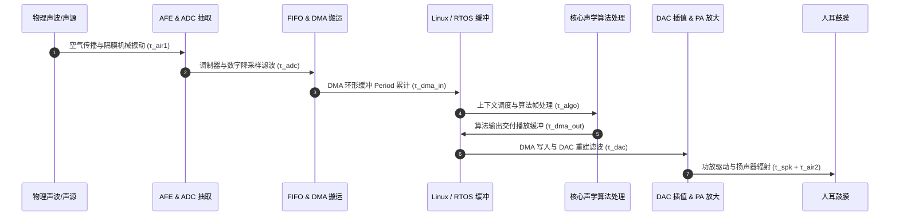

# 横向专题 2：全链路极低音频延迟预算优化

## 1. 核心工程问题与声学延迟阈值

在专业音频监听、无线 K 歌实时耳返、云游戏电竞对战以及端侧主动降噪（ANC）场景中，**端到端音频延迟（End-to-End Latency）** 直接决定了产品的生死线：

| 业务场景 | 容忍延迟阈值 | 超过阈值的破坏性体验 |
| :--- | :--- | :--- |
| **主动降噪（ANC）** | **$< 10 \sim 15\ \mu\text{s}$** | 声波相位无法对消，反向声波变为同相叠加，引发剧烈自激啸叫 |
| **空间音频头部追踪（MTHL）** | **$< 15\text{ ms}$** | 视觉画面与声场旋转脱节，导致严重前庭眩晕感（Vestibular Mismatch） |
| **K 歌无线麦克风实时耳返** | **$< 8 \sim 10\text{ ms}$** | 人耳听到颅骨传导声音与耳机还音产生梳状滤波效应（Comb Filtering），歌者产生“回声”失真而无法跟拍 |
| **专业音乐制作与乐器监听** | **$< 3 \sim 5\text{ ms}$** | 打击乐器按键到出声有肉眼可见顿挫感，丧失演奏手感 |
| **交互式端侧大模型流式语音** | **$< 300 \sim 500\text{ ms}$** | 用户对话出现冷场，打断感知迟钝，破坏人机交流自然度 |

本专题建立数学与工程统一的**全链路时延逐级量化预算模型**，并给出极致压缩至 Sub-5ms 的实战优化体系。

---

## 2. 全链路时延分解流水线架构



系统端到端总时延表达式为：
$$\tau_{\text{total}} = \tau_{\text{air1}} + \tau_{\text{adc}} + \tau_{\text{dma\_in}} + \tau_{\text{os}} + \tau_{\text{algo}} + \tau_{\text{dma\_out}} + \tau_{\text{dac}} + \tau_{\text{spk}} + \tau_{\text{air2}}$$

---

## 3. 七级时延量化模型与公式推导

### 第一级：声学传播与传感器物理时延（$\tau_{\text{air}} + \tau_{\text{sensor}}$）
- **空气声速**：在 $20^\circ\text{C}$ 常温常压下，声速 $c \approx 343\text{ m/s}$，即声波每传播 $1\text{ mm}$ 耗时约 **$2.92\ \mu\text{s}$**（传播 $1\text{ 米}$ 消耗约 $2.92\text{ ms}$）。
- **麦克风振膜惯性**：MEMS 麦克风振膜质量极轻（微克级），物理响应滞后 $< 2\ \mu\text{s}$，通常可忽略。

### 第二级：ADC 调制与降采样抽取滤波（$\tau_{\text{adc}}$）
Sigma-Delta ADC 在过采样率（例如 $64 f_s$ 或 $128 f_s$）下输出 1-bit PDM 脉冲，必须通过数字抽取滤波器（Decimation Filter）降采样至音频 PCM 采样率。
- **线性相位 FIR 滤波器群延时（Group Delay）**：
  $$\tau_{\text{FIR}} = \frac{N - 1}{2 \cdot f_s}$$
  其中 $N$ 为滤波器阶数。若采用工业标准的 64 阶对称线性相位抽取滤波器，在 $48\text{ kHz}$ 采样率下：
  $$\tau_{\text{adc}} = \frac{63}{2 \times 48000} \approx 0.656\text{ ms}$$
- **优化对策**：改用**最小相位 IIR 滤波器（Minimum-Phase IIR）**，可将群延时压缩至 **$< 0.1\text{ ms}$**，代价是高频带来轻微非线性相位失真。

### 第三级：FIFO 水印与 DMA 突发传输延迟（$\tau_{\text{dma}}$）
音频接口（I2S/TDM）内部的硬件 FIFO 需要累积一定样点后触发 DMA 传输请求：
$$\tau_{\text{fifo}} = \frac{\text{Watermark Level}}{f_s}$$
- 若 FIFO 阈值设为 16 samples，在 $48\text{ kHz}$ 下引入 $\frac{16}{48000} \approx 0.333\text{ ms}$；
- **优化对策**：将 Watermark 降至 2~4 samples，或在低延迟专用核上采用寄存器级直接轮询传输。

### 第四级：操作系统驱动环形缓冲延迟（$\tau_{\text{os}}$）
Linux ALSA 采用分段环形缓冲机制（Period 与 Buffer）。应用程序与驱动之间的数据交接以 `period_size` 为基本粒度：
$$\tau_{\text{driver}} = \frac{\text{period\_size}}{f_s} \times \text{period\_count}$$
- **标准桌面 Linux 配置**：`period_size = 1024`，`count = 3`，在 $48\text{ kHz}$ 下基础时延高达：
  $$\tau_{\text{driver}} = \frac{1024 \times 3}{48000} = 64\text{ ms}$$
- **低延迟调优配置**：打上 `PREEMPT_RT` 实时补丁，将 `period_size` 压至 **64 samples**（$1.33\text{ ms}$），甚至 **32 samples**（$0.67\text{ ms}$）。

### 第五级：声学算法帧时延与重叠缓冲（$\tau_{\text{algo}}$）
- **频域算法（STFT）**：
  传统回声消除（AEC）与降噪（ANS）采用短时傅里叶变换，典型帧长 $N = 512$（$10.67\text{ ms}$），帧移（Hop Size）$R = 256$（$5.33\text{ ms}$）。重叠相加（OLA）必须等待整帧缓冲齐备，算法固有单向时延为：
  $$\tau_{\text{algo\_STFT}} \ge \text{Frame Length} = 10.67\text{ ms}$$
- **时域算法（IIR / 分块自适应滤波）**：
  采用时域递归滤波或极小块时域 LMS 算法（块长 16 点），算法延迟降至：
  $$\tau_{\text{algo\_time}} = \frac{16}{48000} \approx 0.33\text{ ms}$$

### 第六级：DAC 插值滤波与功率放大（$\tau_{\text{dac}} + \tau_{\text{spk}}$）
- **DAC 重建插值**：DAC 内部将 $48\text{ kHz}$ 样点上采样至 $64 f_s$ 或 $128 f_s$，其反混叠数字滤波器带来群延时：
  $$\tau_{\text{dac}} \approx \frac{N_{\text{interp}} - 1}{2 \cdot f_{\text{in}}} \approx 0.4 \sim 0.7\text{ ms}$$
- **功放与扬声器机械惯性**：扬声器音圈从通电到驱动纸盆产生位移的机电时间常数约 $0.1 \sim 0.3\text{ ms}$。

---

## 4. 全链路极低时延优化策略矩阵

```
+-------------------------------------------------------------------------+
|                  全链路 Sub-5ms 极低时延优化四重奏                        |
+-------------------------------------------------------------------------+
| [1. 物理层] 采样率翻倍提升至 96kHz / 192kHz (所有抽取/插值延时减半)       |
| [2. 算法层] 放弃大帧频域计算, 全面切换至时域极小块/递归滤波 (0.33ms)      |
| [3. 驱动层] PREEMPT_RT 补丁 + CPU 绑核 + period_size=32/64 点无锁环形缓冲 |
| [4. 协议层] 抛弃传统蓝牙 A2DP (150ms), 采用 2.4GHz 专有超短帧时分协议    |
+-------------------------------------------------------------------------+
```

### 优化前后全链路延迟预算对比表（基于 48kHz / 96kHz 链路）

| 处理环节 | 通用消费级系统配置 | 极致低延迟专业系统优化方案 | 优化后时延 |
| :--- | :--- | :--- | :--- |
| **ADC 抽取滤波** | 64 阶线性相位 FIR ($48\text{ kHz}$) | 最小相位超低延时 IIR ($96\text{ kHz}$) | **$0.12\text{ ms}$** |
| **硬件 DMA 缓冲** | 水印 32 样点 | 水印 4 样点 | **$0.04\text{ ms}$** |
| **驱动与系统调度** | 普通 Linux (`period=512`) | RTOS / Linux RT (`period=32`, 独立核) | **$0.33\text{ ms}$** |
| **声学前处理算法** | 512 点 STFT 频域降噪 | 16 点时域自适应分块滤波 | **$0.33\text{ ms}$** |
| **DAC 重建滤波** | 传统陡峭 FIR 插值 | 最小相位高速插值 ($96\text{ kHz}$) | **$0.15\text{ ms}$** |
| **无线空中传输** | 蓝牙 Classic AAC/SBC | 2.4GHz 私有物理层 (1ms 时隙 TDMA) | **$1.80\text{ ms}$** |
| **扬声器与物理间距** | 耳机佩戴 ($1\text{ cm}$ 气隙) | 耳机佩戴 ($1\text{ cm}$ 气隙) | **$0.03\text{ ms}$** |
| **整机端到端总延迟** | **$\approx 85 \sim 180\text{ ms}$** | **全链路极限压缩至** | **$\mathbf{2.80\text{ ms}}$** |

---

## 5. 延迟测量与回环推演方法（Loopback Measurement）

在实验室与量产调试中，精确测量端到端延迟必须采用**闭环脉冲法（Loopback Impulse Test）**：

1. **测试信号注入**：由专业音频分析仪（如 APx555）产生一个狄拉克脉冲 $\delta(t)$（或最大长度序列 MLS / 单周期正弦波）；
2. **硬件物理回环**：将信号送入设备输入端，经过整机全链路后由输出端输出并回采至分析仪输入端；
3. **互相关峰值定位**：将回采信号 $y(t)$ 与原始参考信号 $x(t)$ 进行互相关运算：
   $$R_{xy}(\tau) = \int_{-\infty}^{+\infty} x(t) y(t + \tau) dt$$
   互相关函数取得绝对最大峰值处对应的横坐标时间差 $\tau_{\text{peak}}$ 即为**整机绝对物理延迟**。
