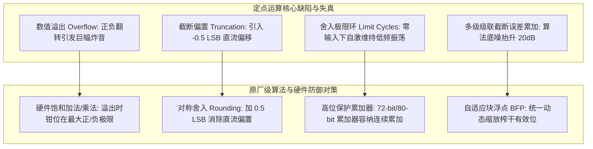
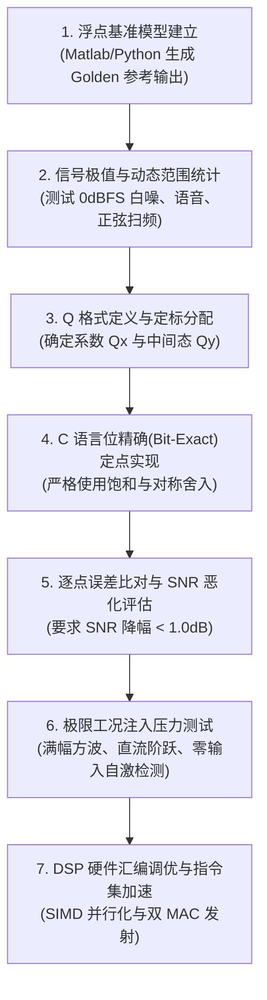

# 横向专题 3：声学算法浮点转定点量化分析

## 1. 核心工程问题与定点化必然性

在现代低功耗音频系统（TWS 耳机、智能手表、IoT 语音模组）中，嵌入式主控或协处理器（如 Tensilica HiFi 3/4/5、CEVA-BX、ARM Cortex-M55/M7、RISC-V with P-extension）通常面临严苛的功耗与面积预算：

- **PPA（功耗/性能/面积）巨大收益**：
  - 硬件 32 位单精度浮点单元（FPU）的硅片面积约为 32 位定点乘加器（MAC）的 **$3 \sim 5$ 倍**；
  - 执行一次单精度浮点乘加运算的动态功耗约为定点整型乘加的 **$4 \sim 8$ 倍**；
- **定点化挑战**：
  算法团队在 PC 端（Matlab/Python）基于 IEEE 754 浮点（32-bit float / 64-bit double）设计了声学算法（AEC、ANC、NS、EQ）。如果直接强行移植到定点 DSP，常因**算术溢出（Overflow）** 导致炸音爆音，或因**量化截断误差（Quantization Error）** 导致底噪劣化、滤波器失稳发散。

本专题建立定点 Q 格式数学模型、量化噪声传递方程与自适应块浮点工程规范。

---

## 2. 定点数体系与 Q 格式表示法

在数字信号处理中，定点数使用补码（Two's Complement）表示实数，通过约定虚拟小数点的物理位置来平衡**动态范围（Dynamic Range）** 与 **数值分辨率（Resolution）**：

$$Q_{m.n}: \text{总字长 } B = m + n + 1 \text{ (包含 1 个符号位)}$$

在 32-bit 音频 DSP 中，最核心的格式为 **Q31**（$m=0, n=31$）：
- **数值范围**：$[-1.0, \ 1.0 - 2^{-31}] \implies [-1.0, \ 0.999999999534]$
- **最小分辨率（LSB）**：$\Delta = 2^{-31} \approx 4.6566 \times 10^{-10}$
- **理论信噪比与动态范围（SNR / DNR）**：
  $$\text{DNR} = 6.02 \cdot B + 1.76\text{ dB} \approx 6.02 \times 31 + 1.76 \approx \mathbf{188.38\text{ dB}}$$
  远超人耳可听动态范围极限（$120\text{ dB} \sim 130\text{ dB}$）和高端 ADC 物理上限（$120\text{ dB}$）。

---

## 3. 定点运算四大失真与防御体系

### 1. 溢出处理：算术环绕 vs. 硬件饱和（Saturation）
- **算术环绕（Wrapping Bug）**：
  标准 C 中有符号整型溢出是未定义行为；只有无符号运算按模数环绕，不能依赖有符号溢出实现饱和。例如最大正数 `0x7FFFFFFF` （接近但小于 +1.0） 在采用环绕语义的实现中加 `1` 会翻转为最大负数 `0x80000000` ($-1.0$)，在扬声器输出端产生最大峰峰值的全幅方波阶跃，听到极其刺耳的破音（Click）。
- **硬件饱和截断（Saturating Math）**：
  专用 DSP 指令集（如 ARM CMSIS `__QADD`, RISC-V `kadd32`）通过单周期硬件检测溢出标志：
  $$\text{res} = \begin{cases} 0x7FFFFFFF, & \text{if } a + b > 0x7FFFFFFF \\ 0x80000000, & \text{if } a + b < -0x80000000 \\ a + b, & \text{otherwise} \end{cases}$$

### 2. 明确舍入模式与边界

Q31 的范围为 [-1, 1)。但 (-1) × (-1) = +1，结果无法用 Q31 正数表示，必须饱和到 INT32_MAX。int64_t 可以保存两个 int32_t 的乘积。

“加半 LSB 再右移”不等于 ties-to-even（收敛舍入），负数右移在 C99 中还依赖实现。示例 Lab 03 使用符号对称的最近舍入、半值远离零：正乘积加 2^30 后除 2^31；负乘积对绝对值同样处理再取负，最后限幅。截断误差均值还依赖输入分布；不能保证 IIR 一定出现明显 DC，也不能靠舍入消除所有极限环。

### 3. 累加范围需要证明

N 个接近满幅的乘积需要额外整数保护位。DSP 累加器位宽因 ISA 和指令而异，不能假定所有 Audio DSP 都有 72/80-bit 累加器。即便存在扩展位宽，也要检查乘积格式、N、输入边界与饱和位置。

[Lab 03](../Labs/lab03-fixed-point-dsp-aec-filter/README.md)先把每项乘积舍入、饱和为 Q31，再用 int64_t 累加 32 项，最后限幅；32 × 2^31 的范围可安全容纳。这与完整 Q62 乘积累加后只舍入一次并不等价，会有不同量化误差，但有明确且可测试的数值契约。

---

## 4. 自适应块浮点（Block Floating Point, BFP）架构

在执行大点数 FFT（如 512 点或 1024 点）或频域自适应滤波时，若全局采用固定保守定标，小信号时的大量有效高位为全 `0`，信噪比剧烈恶化；若定标过于激进，大信号时又会频繁溢出。

**自适应块浮点（BFP）** 在有限整型硬件上完美融合了浮点的动态范围与定点的超低功耗：

下面是设计步骤，不是可直接编译的 SDK 代码：

1. 在至少 64-bit 有符号临时变量中求 int32 输入绝对值，避免对 INT32_MIN 直接取负。
2. 空块和全零块保持不变；不要对零调用语义未定义的 CLZ 内建函数。
3. 根据正、负边界共同计算可用 headroom，保留算法需要的保护位。
4. 用足够宽的乘法实现缩放并检查范围，不对负的有符号整数左移。
5. 检查共享指数的上下界，再原子地更新块数据和指数；后续乘加必须携带指数信息。

实现应补测全零、INT32_MIN、正负满幅、单元素及指数极限。BFP 能改善部分信号的动态范围，但不能凭这种预处理保证无溢出或固定音质收益。

---

## 5. 定点算法原厂工程验证七步法则

- **合格验收指标**：
  在 $-60\text{ dBFS}$ 小信号与 $0\text{ dBFS}$ 大信号输入下，定点化实现与浮点 Golden 结果的**均方误差（MSE）应小于 $-80\text{ dB}$**，系统总谐波失真加噪声（THD+N）退化不得超过 **$0.5\text{ dB}$**。
