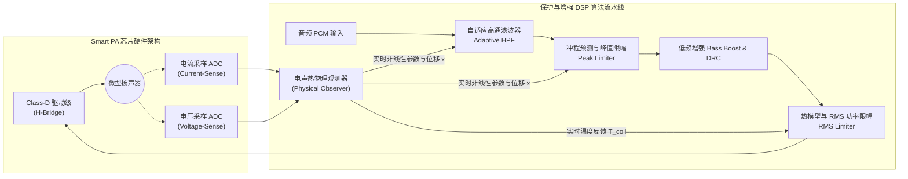

# 横向专题 4：微型扬声器热保护与冲程保护

## 1. 核心工程问题与微型扬声器物理极限

在智能手机、智能手表、TWS 充电盒以及微型智能音箱中，受限于极度逼仄的工业设计（ID）物理空间，音频微型扬声器（Micro-speaker / Receiver）面临严重的物理矛盾：

1. **小声学腔体与大音量的冲突**：
   声辐射效率与扬声器振动面积的平方成正比。微型振膜（如 $11\text{ mm} \times 15\text{ mm}$）在重放低频（$100\text{ Hz} \sim 500\text{ Hz}$）时声辐射阻极小。为了让用户听清手机外放低音或视频通话，驱动功放必须向微型扬声器注入远超额定标称功率（如额定 0.5W，瞬间注入高达 3W~5W）的电信号。
2. **音圈热烧毁（Thermal Destruction）**：
   微型扬声器音圈由超细漆包铜线绕制，质量仅数十毫克，热容极小。持续大功率发热会导致音圈温度在数秒内冲破绝缘漆耐受温度极限（通常为 **$140^\circ\text{C} \sim 180^\circ\text{C}$**），导致匝间短路或引线烧断。
3. **机械冲程拍边破损（Mechanical Excursion Exceeding $X_{\max}$）**：
   低频声压与振膜位移成正比。当振膜物理位移 $x(t)$ 超过安全机械极限（通常 $X_{\max} \approx 0.4\sim 0.6\text{ mm}$）时，音圈骨架将直接撞击磁极底部铁芯（称为**拍边/打底 Bottoming**），引发破响尖叫并导致定心支片与振膜不可逆撕裂。

为了突破物理尺寸限制并榨干扬声器的最大声学潜能，芯片原厂普遍采用**带电流电压传感（IV-Sense）的智能功率放大器（Smart PA）闭环保护系统**。

---

## 2. Smart PA 闭环硬件与算法架构

---

## 3. 电声热双重物理建模与数学公式

### 1. 音圈动态阻抗与实时测温模型
纯金属铜线的直流电阻随温度升高呈线性递增关系：
$$R_e(T) = R_{e0} \cdot \left[ 1 + \alpha_{\text{Cu}} (T_{\text{coil}} - T_0) \right]$$
其中铜的电阻温度系数 $\alpha_{\text{Cu}} \approx 0.00393\ /\ ^\circ\text{C}$，$T_0$ 为室温（$25^\circ\text{C}$）。

IV-Sense 模块以 $48\text{ kHz}$ 或更高的采样率同步采集扬声器两端的端电压 $v(t)$ 与流过音圈的电流 $i(t)$，通过最小二乘法（RLS）滤除感抗与反电动势分量后提取纯直流阻抗：
$$R_e = \frac{\sum v(t)}{\sum i(t)}$$
代入上式即可**在不引入任何额外热敏电阻探头的前提下，以毫秒级刷新率精准反算音圈真实瞬态温度 $T_{\text{coil}}$**。

### 2. 热力学二阶 RC 网络等效模型
热量从音圈传递到磁路系统，再耗散到外部空气：
$$\begin{aligned}
C_{vc} \frac{dT_{\text{coil}}}{dt} &= P_{\text{elec}} - \frac{T_{\text{coil}} - T_{\text{magnet}}}{R_{th\_vm}} \\
C_{m} \frac{dT_{\text{magnet}}}{dt} &= \frac{T_{\text{coil}} - T_{\text{magnet}}}{R_{th\_vm}} - \frac{T_{\text{magnet}} - T_{\text{ambient}}}{R_{th\_ma}}
\end{aligned}$$
- $C_{vc}$：音圈热容（极小，温升响应极快，时间常数 $\tau \approx 0.5\sim 2\text{ s}$）；
- $C_m$：磁铁金属热容（较大，时间常数 $\tau \approx 20\sim 60\text{ s}$）；
- $R_{th\_vm}, R_{th\_ma}$：音圈至磁铁、磁铁至环境的热阻。

### 3. 机械振膜冲程非线性微分方程
微型扬声器的机械运动符合牛顿第二定律扩展的机电耦合微分方程：
$$M_{ms} \frac{d^2 x(t)}{dt^2} + R_{ms}(x) \frac{dx(t)}{dt} + K_{ms}(x) \cdot x(t) = Bl(x) \cdot i(t)$$
在微型扬声器大信号驱动下，力因子 $Bl(x)$ 和悬挂系统劲度系数 $K_{ms}(x)$ 呈现严重的非线性对称衰减：
$$Bl(x) = Bl_0 \cdot (1 - \beta x^2), \quad K_{ms}(x) = K_0 \cdot (1 + \gamma x^2)$$
算法根据该状态空间方程对下一个音频块的位移峰值 $x_{\text{pred}}(t)$ 进行前向积分预测。

---

## 4. 闭环控制算法策略与调优

### 策略 1：冲程动态限幅与自适应高通切除
- 当预测振膜位移 $x_{\text{pred}} < 0.8 X_{\max}$ 时，自适应 HPF 截止频率维持在最低截止点（例如 $120\text{ Hz}$），保留深邃饱满的低音下潜；
- 当遇到爆破音或大动态鼓点，预测位移即将突破 $X_{\max}$ 时：
  1. **自适应 HPF 上移**：动态将高通截止频率推高至 $200\text{ Hz} \sim 300\text{ Hz}$，精准切除最消耗位移的极低频能量；
  2. **峰值限幅器（Lookahead Peak Limiter）**：在缓冲前瞻时间内施加平滑增益衰减曲线，硬性拦截位移过冲，彻底杜绝打底破响。

### 策略 2：热保护平滑功率压缩（Thermal RMS Limiter）
- 设定安全预警温度 $T_{\text{warn}} = 120^\circ\text{C}$，硬极限温度 $T_{\text{shutdown}} = 150^\circ\text{C}$；
- 当 $T_{\text{coil}} > T_{\text{warn}}$ 时，启动缓慢 Attack / 缓慢 Release 的 RMS 功率压缩器，以 $0.5\text{ dB/step}$ 的微小步长平抑信号电平。人耳对缓慢的响度微调极不敏感，既保护了扬声器音圈安全降温，又避免了突兀的音量抽吸效应（Pumping Effect）。

---

## 5. 产测校准与金机参数提取规范

在量产阶段，不同批次扬声器的初始直流阻抗 $R_{e0}$ 存在 $\pm 10\%$ 的工艺离散度。产测阶段必须实施严格校准：
1. **常温暗室校准（Ambient Calibration）**：
   设备在 $25^\circ\text{C}$ 恒温产线测试治具中，注入 $-20\text{ dBFS}$ 的纯净 $1\text{ kHz}$ 测试单音，持续 $200\text{ ms}$；
2. **出厂初始阻抗熔丝固化**：
   IV-Sense 计算各机台扬声器的精确物理阻抗基准值 $R_{e0}$，写入 SoC / Smart PA 的内部 eFuse 或 Flash 保留区；
3. **Klippel 大信号非线性参数匹配**：
   在研发阶段使用专业 Klippel 激光多普勒位移计扫描扬声器非线性曲线，提取出精确的 $Bl(x)$、$K_{ms}(x)$ 与热阻常数矩阵，固化至 DSP 算法参数固件中。
