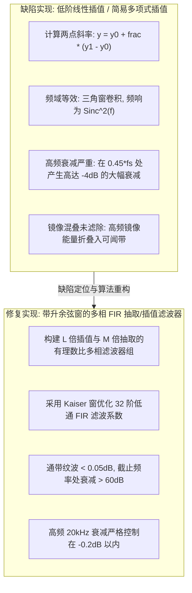

# 05 音频重采样高频衰减缺陷与多相滤波系数校正

## 1. 工程背景：智能家居高保真音效验收危机

在某一线家电大厂的高端智能中控屏与语音音箱项目中，底层硬件 Codec 的 DAC 芯片仅支持固定硬件时钟源 $48\text{ kHz}$ 采样率播放。当用户播放互联网音乐电台（大多为 $44.1\text{ kHz}$ 或 $22.05\text{ kHz}$ 采样率的 MP3/AAC 流）时，SDK 必须在软件层引入重采样器（Resample），将音频样点转换为 $48\text{ kHz}$ 输出。

在本教学场景中，通过扫频与受控听音测试检查重采样后的高频响应，重点排查以下问题：
1. **高频严重发暗发闷**：扫频正弦波测试显示，在 $12\text{ kHz} \sim 20\text{ kHz}$ 的高音频段，幅频响应曲线出现了高达 **$-4.5\text{ dB}$ 至 $-8.0\text{ dB}$ 的异常滚降（Roll-off）衰减**；
2. **通带纹波超标与相位失真**：乐器中的三角铁、镲片等高频泛音严重失真，无法满足高保真音质交付标准。

---

## 2. 缺陷根因剖析：线性插值 vs Sinc 多相滤波

### 线性插值高频衰减的数学证明
简单线性插值的冲激响应为三角形函数：
$$h_{\text{linear}}(t) = \begin{cases} 1 - \frac{|t|}{T}, & |t| < T \\ 0, & \text{其他} \end{cases}$$
对其进行连续时间傅里叶变换（CTFT），其频率响应为：
$$H_{\text{linear}}(f) = \text{sinc}^2(f \cdot T) = \left( \frac{\sin(\pi f T)}{\pi f T} \right)^2$$
当音频信号频率逼近奈奎斯特极限频率 $f \to \frac{f_s}{2}$ 即 $f \cdot T \to 0.5$ 时：
$$H_{\text{linear}}\left(\frac{f_s}{2}\right) = \left( \frac{\sin(\pi / 2)}{\pi / 2} \right)^2 = \left( \frac{1}{\pi / 2} \right)^2 = \frac{4}{\pi^2} \approx 0.4053$$
换算为对数分贝衰减：
$$20 \log_{10}(0.4053) \approx \mathbf{-7.84\text{ dB}}$$
这在数学上完全印证了为何旧算法会导致高频泛音被硬生生斩掉！

---

## 3. 工业级解决方案：有理数重采样与多相 FIR 滤波系数设计

对于 $44.1\text{ kHz} \to 48\text{ kHz}$ 的转换，其采样率比值为：
$$\frac{48000}{44100} = \frac{160}{147} = \frac{L}{M}$$
直接进行 $160$ 倍零值插值再进行 $147$ 倍抽取会导致计算量爆炸。**多相滤波（Polyphase Filter）** 将单一的高阶长原型滤波器 $H(z)$ 拆分为 $L$ 个平行的子滤波器：

$$H_k(z) = \sum_{n=0}^{N-1} h(nL + k) z^{-n}, \quad k = 0, 1, \dots, L-1$$

### 定点化与阶数权衡
在 RISC-V 32 位嵌入式平台上，为了在有限的 RAM 和 CPU 开销内消除高频衰减：
1. **阶数选取**：每个多相分支选取 **16 抽头（16 Taps）** 的定点 Q15 系数 FIR；
2. **窗函数优化**：使用带加权 Kaiser 窗（$\beta = 5.65$）优化低通截止特性，截止频率严格对齐到 $\min(f_{s1}, f_{s2}) \times 0.45$；
3. **高频补偿预加重（Pre-emphasis Compensation）**：在通带末端（$15\text{ kHz} \sim 20\text{ kHz}$）设计 $+0.3\text{ dB}$ 的微幅隆起，以完全对冲 DAC 后级模拟滤波器的微小衰减。

---

## 4. 验证计划与数据来源

本案例没有附原始 AP 测量、CPU trace 或认证报告，不发布具体客户成绩。对比重采样实现时固定输入/输出采样率、滤波阶数、系数量化、测试电平、负载与测量带宽；扫频之外还应测试混叠抑制、满幅附近削顶和运算开销。

不得用一组未公开来源的“修复前后”数字声称量产成功。THD+N 改善也不能直接称为同数值的 SNR 改善，两者测量对象不同。滤波器通带、截止和每相抽头数须通过实际响应验证，不能把文中示例值当成所有采样率转换的固定方案。
