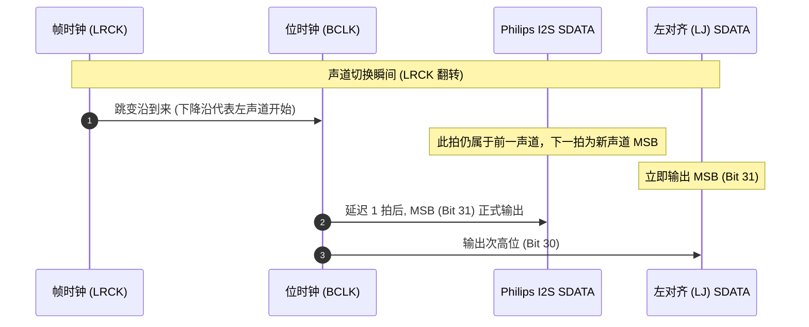

# Lab 01: I2S 协议时序仿真与软件音频波形生成

## 1. 实验目标与微架构背景

I2S（Inter-IC Sound）是音频芯片间传输 PCM 采样点的工业事实标准总线。初学者与初级驱动工程师最常犯的错误，就是将 **Philips 标准 I2S** 与 **左对齐（Left-Justified）** 格式混淆，导致解出来的音频高频尖锐爆破或左右声道颠倒。

本实验目标：
1. 用纯 C 语言构建周期精确（Cycle-Accurate）的硬件移位寄存器微架构模型；
2. 掌握主控发送端（Master TX）下降沿更新数据、从端接收（Slave RX）上升沿采样的物理建立与保持时间约束；
3. 输出工业标准数字波形文件 **`i2s_trace.vcd` (Value Change Dump)**，可在开源波形查看器 **GTKWave** 中进行全时序波形抓包分析。

---

## 2. 硬件移位状态机时序对比



- **Philips I2S 标准**：LRCK 的跳变沿领先第一个有效数据位（MSB）整整 **1 个 BCLK 周期**。
- **左对齐（Left-Justified）**：LRCK 跳变沿与 MSB 的数据有效时刻在时间上**完全重合**。

---

## 3. 独立工程文件清单

本实验提供完整、可独立编译执行的工程套件：

- [`i2s_simulator.c`](i2s_simulator.c)：周期精确移位模拟器源码，集成 VCD 格式生成器
- [`Makefile`](Makefile)：支持 `make` 编译、`make run` 仿真执行与 `make view` 波形查看

---

## 4. 源码与验证边界

以独立源码为准，不在本文复制第二份实现。WS 每 32 个 BCLK 切换；Philips I2S 的 WS 提前一位，切换时仍发送上一声道的 LSB，下一拍发送新声道 MSB，不应将声道槽拉长到 33 拍。本实现支持 I2S 和左对齐，不实现右对齐。

`test_i2s.c` 对两种格式检查左右声道全部 32 位、WS 切换间隔与上升沿数据稳定性。VCD 使用近似时标，只作数字协议示意，不模拟电气建立/保持、jitter 或真实器件 timing closure。


## 5. 编译与实验验证步骤

```bash
# 1. 编译并运行仿真
make run
cc -std=c99 -Wall -Wextra test_i2s.c -o /tmp/yvain-audio-i2s-check
/tmp/yvain-audio-i2s-check

# 2. 观察终端输出的逐周期比对日志
# 确认 Cycle #00 为延迟空闲拍, Cycle #01 开始移出 0xA5A55A5A 的最高有效位 '1'

# 3. 使用 GTKWave 打开波形查看器
gtkwave i2s_trace.vcd
```

在 GTKWave 中检查 WS 每 32 个 BCLK 翻转，以及新声道 MSB 相对 WS 延后一拍。不要仅凭“SDATA 首次电平变化”判断位位置：相邻数据位可能相同，应使用已知样本解码核对。协议依据见 [NXP I2S bus specification](https://www.nxp.com/docs/en/user-manual/UM11732.pdf)。
