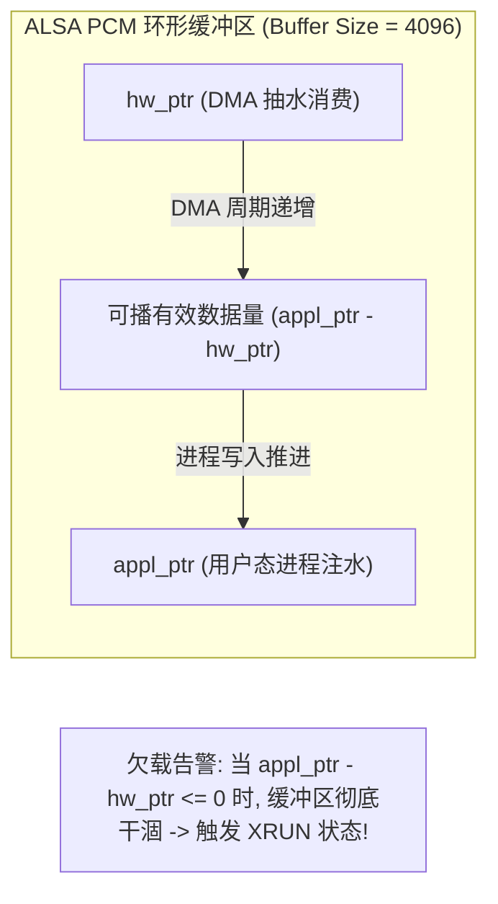

# Lab 02: Linux ALSA 虚拟声卡驱动与 TinyALSA 环形缓冲跟踪

## 1. 实验目标与内核微架构背景

在 Linux 音频驱动与中间件开发中，**XRUN（Underrun 欠载 / Overrun 溢出）** 是导致音频“爆音、杂音、卡顿、跳帧”的最核心根因。

ALSA PCM 核心采用双指针管理的环形缓冲区（Ring Buffer）：
- **`hw_ptr`（硬件指针）**：代表底层硬件 DMA 已经搬运完毕的采样点物理位置，随 DMA 中断持续单向递增；
- **`appl_ptr`（应用指针）**：代表用户态应用程序（TinyALSA `tinyplay` / `tinycap` / PipeWire / PulseAudio）通过 `writei` 写入或 `readi` 读出采样点的指针位置。



本实验目标：
1. 掌握 `/proc/asound/` 虚拟文件系统节点对内核 PCM 状态的观察方法；
2. 运行精密测试音频生成器与动态水位监视器；
3. 自动化注入 CPU 调度饥饿故障，亲手复现、捕获并分析一次内核级 XRUN 欠载现场。

---

## 2. 独立工程文件清单

- [`generate_tone.py`](generate_tone.py)：纯 Python 标准库生成 16-bit 48kHz 双声道纯正正弦波测试 WAV 音频
- [`xrun_monitor.py`](xrun_monitor.py)：实时轮询 `/proc/asound` 状态节点，以 ASCII 水位柱状图动态显示环形缓冲填充率，检测 `XRUN` 状态并告警（支持非 Linux 环境跨平台仿真）
- [`run_xrun_test.sh`](run_xrun_test.sh)：全自动流水线脚本（自动挂载驱动、启动播放、发送 `SIGSTOP` 人为饥饿、抓取内核状态）
- [`Makefile`](Makefile)：一键测试脚本

---

## 3. 实验步骤与命令

### 方式 A：一键全自动测试执行
```bash
# 自动生成测试单音并执行故障注入与监控
make run
```

### 方式 B：跨平台水位与 XRUN 仿真演练
在非 Linux 系统（如 macOS）或未连接声卡的开发板上，直接运行跨平台监视器：
```bash
make monitor
```

### 方式 C：手工逐步深入探索（Linux 环境）
```bash
# 1. 挂载内核虚拟声卡
sudo modprobe snd-dummy

# 2. 确认声卡节点已生成
cat /proc/asound/cards

# 3. 后台启动音频播放
python3 generate_tone.py test.wav
tinyplay test.wav -D 0 -d 0 -p 128 -n 2 &
PID=$!

# 4. 实时观察指针动态推进
cat /proc/asound/card0/pcm0p/sub0/status

# 5. 人为冻结应用进程制造欠载
kill -STOP $PID
sleep 1

# 6. 查看状态变为 XRUN
cat /proc/asound/card0/pcm0p/sub0/status | grep "state"

# 7. 清理进程
kill -KILL $PID
```

---

## 4. 现场排错与原厂调优对策

当在量产产品中出现 `XRUN` 时，驱动工程师的标准排查顺序：
1. **调大硬件缓冲**：在 `tinymix` 或驱动参数中增大 `period_size`（如由 128 点提升至 512 点）与 `period_count`；
2. **进程调度优先级提升**：为用户态音频渲染线程设置实时调度策略：`chrt -f 90 <PID>` 或 `SCHED_FIFO`；
3. **消除内核关中断延迟**：排查系统中是否有其他恶劣驱动执行耗时过长的 `spin_lock_irqsave`，导致音频 DMA 中断无法被及时响应。
