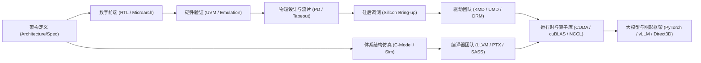

# 00 总览与学习路线（原厂视角）

先阅读 [掌握标准与面试复习图谱](01-review-and-evidence-map.md)，用可验收的能力组织以下路线；完整推演见 [GEMM 性能证据链](../Case-Studies/04-gemm-evidence-path.md)。

## 原厂研发分工与全局视角

在一家 GPU 芯片原厂中，一款芯片的研发涉及从系统架构定义到最终上层应用适配的数十个软硬件协同团队：



---

## 三条原厂核心学习路线

### 路线 1：算子开发、编译器与性能优化线（Compute & Optimization Track）
- **核心目标**：建立 GEMM、Attention 的性能上界与证据链；按形状、精度和设备判断优化空间，不预设统一 MFU 门限。
- **推荐路径**：
  ```text
  01 GPU 总体架构 → 02 SIMT 与 Warp 调度 → 03 显存系统与 Bank 冲突
  → 06 异步搬运与 DMA → 10 Roofline 与 NSight 性能调优
  → Case-Studies 01 FlashAttention → Labs 01 GEMM 优化
  ```

### 路线 2：底层驱动、系统软件与内核线（Driver & System Software Track）
- **核心目标**：掌握 Linux KMD/UMD、MMU 虚拟内存映射、Ring Buffer 任务提交与故障排查。
- **推荐路径**：
  ```text
  01 GPU 总体架构 → 04 GPU MMU 与 UVM → 05 PCIe/NVLink 高速互联
  → 06 Copy Engine 与 DMA → 09 Linux DRM/KMS 与 UMD
  → 10 GPU Hang 与 XID 诊断 → Labs 03 开源驱动跟踪
  ```

### 路线 3：芯片架构、微架构与系统互联线（Silicon Architecture Track）
- **核心目标**：掌握 GPC/TPC/SM 拓扑、NoC 交叉互联、HBM3 显存控制器、NVLink/NVSwitch 扩展网络。
- **推荐路径**：
  ```text
  01 芯片架构与 Bring-up → 02 计算微架构与 Tensor Core → 03 显存层级与 CoWoS
  → 05 片上片间互联 → 07 DVFS 与功耗管理 → 11 多卡集群与分布式
  → Cross-Topics 01~04
  ```

---

## 原厂工程师的四大自查准则

在审阅任何 GPU 模块设计或排查线上故障时，必须能在微架构层面清晰回答：
1. **指令与控制流**：指令由哪个 Warp Scheduler 发出？Scoreboard 在何处阻塞？
2. **数据与地址流**：数据从哪级存储（Register / Shared / L2 / HBM）搬运？地址是否合并（Coalesced）？是否存在 Bank Conflict？
3. **并发与重叠**：计算与搬运的依赖是否允许重叠？启动、排空、共享带宽和资源争用造成多少无法隐藏的时间？
4. **异常与隔离**：当硬件出现非法访问或超时时，硬件通过何种中断/Event 上报？KMD 如何完成上下文隔离与软复位？
