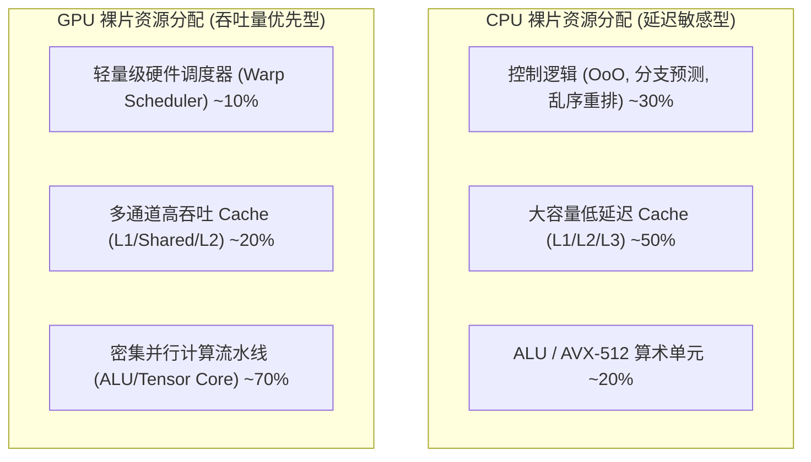
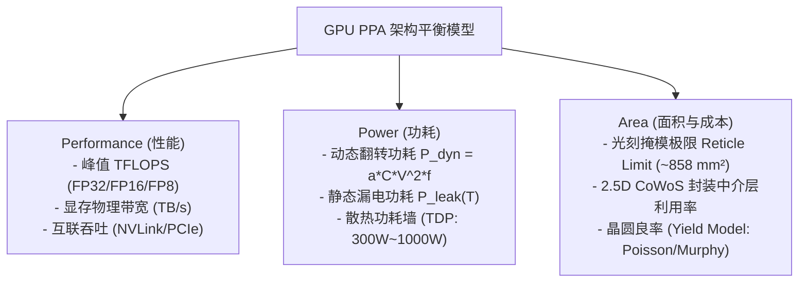

# 01 GPU 芯片定义与 PPA 权衡

## 1. 为什么需要 GPU：算力密度与吞吐优先范式

现代高性能计算、大模型训练和实时图形渲染负载呈现出海量的**数据并行性（Data Parallelism）**。传统通用 CPU 与高性能 GPU 在晶体管资源分配上的哲学有着本质不同：

### CPU 与 GPU 核心设计权衡对比

| 设计维度 | 通用 CPU (如 x86_64 / ARMv9) | 高性能 GPU (如 NVIDIA Hopper / AMD CDNA3) |
| :--- | :--- | :--- |
| **设计核心目标** | 最小化单线程执行延迟（Latency Oriented） | 最大化全芯片总算力吞吐量（Throughput Oriented） |
| **流水线机制** | 超标量、深度乱序执行（Out-of-Order, OoO）、投机执行 | 严格按序/轻度乱序发射、多线程束零开销上下文轮转 |
| **分支预测** | 复杂分支预测器（TAGE/神经网络）、大型 BTB | 掩码栈（SIMT Stack）与独立线程调度（ITS），不采用重度分支预测 |
| **访存机制** | 依赖硬件自动预取器与数级低延迟大 Cache | 依赖海量活跃线程（Massive Concurrency）隐藏数百周期访存延迟 |
| **算力能效比** | 10 ~ 30 GFLOPS/W (FP32) | **200 ~ 500+ GFLOPS/W (Dense), 1000+ TFLOPS/W (FP8 Tensor)** |

---

## 2. 芯片原厂的 PPA 核心设计法则

在 GPU 芯片定义阶段，架构师必须在 **PPA（Performance, Power, Area）** 三角平衡中作出工程抉择：

### 1. 动态功耗与电压平方律
芯片总功耗公式为：
$$P_{total} = \alpha C V_{dd}^2 f + V_{dd} I_{leak}(T)$$
在提升频率 $f$ 时，必须同步提高供电电压 $V_{dd}$ 以满足时序建立时间要求（Setup Time）。电压的平方效应导致功耗急剧上升。因此，GPU 原厂优先选择**堆叠更多的并行 SM 核心以适中频率（如 1.5GHz~2.0GHz）运行，而非像 CPU 一样单核飙升至 5GHz+**。

### 2. 裸片尺寸与 Chiplet / CoWoS 封装
- **单 Die 面积物理极限**：单次光刻曝光面积上限约为 $858\text{ mm}^2$。
- **良率与缺陷密度**：晶圆缺陷符合 Murphy 模型 $Y = \left(\frac{1 - e^{-A D}}{A D}\right)^2$。Die 面积越大，良率呈指数级下跌。
- **Modern GPU Chiplet 方案**：将计算逻辑切分为 2 颗或多颗 Compute Die，通过超短距离高密度凸块（Micro-bumps，间距 $<25\mu m$）在 2.5D 硅中介层（Interposer）上互联，突破物理面积上限。
