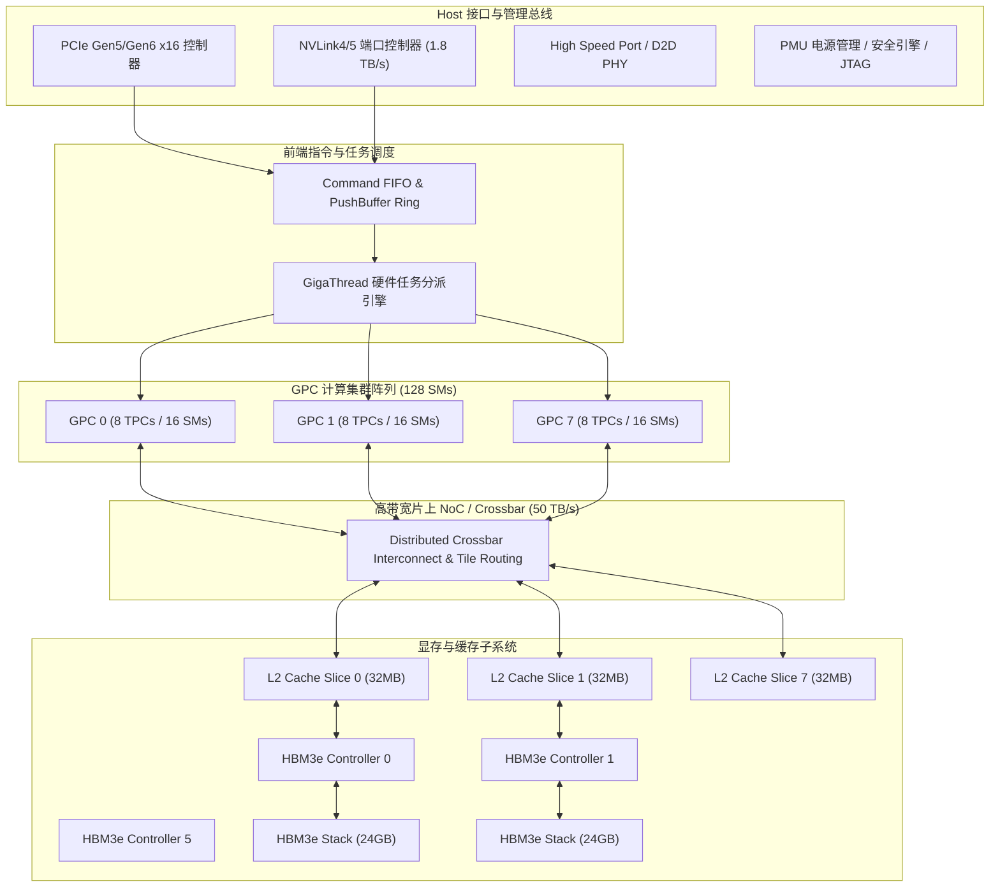
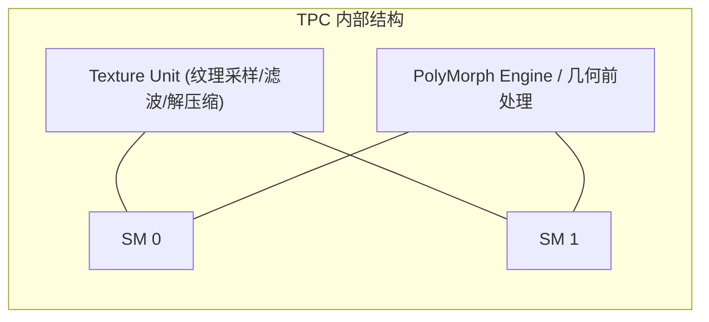

# 02 Block Diagram 与 GPC/TPC/SM 层次拓扑

## 1. 现代高性能 GPU 顶层框图 (Top-Level Block Diagram)

---

## 2. GPC、TPC 与 SM 的物理微架构展开

每个 GPC（Graphics Processing Cluster）由独立的时钟树分支和电源门控开关驱动，内部包含若干 TPC（Texture Processing Cluster），而每个 TPC 包含 2 个独立的 **SM（Streaming Multiprocessor）**：

### 单 SM 内部四路处理分区 (Processing Block / Warp Scheduler)

每个 SM 内部被严格切分为 4 个物理对等的 **Sub-Core (Processing Block)**：
- 每个 Sub-Core 拥有独立的 **1 个 Warp 调度器 (Warp Scheduler) + 1 个指令分派单元 (Dispatch Unit)**；
- 独立映射 **16K 个 32-bit 寄存器 (64KB SRAM)**；
- 包含 **16 个 FP32 ALU、16 个 INT32 ALU、4 个 FP64 ALU、1 个 Tensor Core 矩阵乘单元、4 个 SFU 特殊函数单元**；
- 4 个 Sub-Core 共享统一的 **228KB Shared Memory / L1 Data Cache** 与 L1 Instruction Cache。
