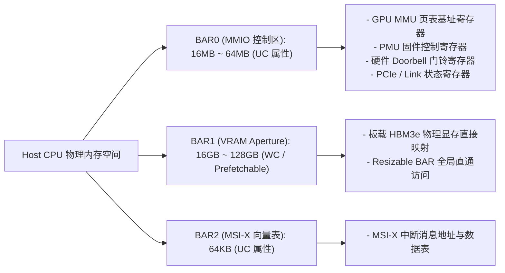

# 03 PCIe BAR 空间与 MMIO 控制映射

## 1. PCIe BAR 空间在 Host 物理地址（HPA）中的布局

当 GPU 插入 Host 主板上电后，Host BIOS / UEFI 通过 PCIe 枚举阶段读取 GPU 配置空间，并分配基地址寄存器（BAR）：



---

## 2. 核心控制寄存器位域定义 (BAR0 典型布局)

### 1. GPU 硬件门铃寄存器 (`DOORBELL_REG_OFFSET: 0x0080_0000`)
```text
+-------------------+--------------------+------------------------+
| 31             16 | 15                8| 7                     0|
|   Ring Buffer ID  |    Priority Class  |  New Tail Pointer (LSB)|
+-------------------+--------------------+------------------------+
```
- **工作机制**：用户态驱动（UMD）无需调用 `ioctl` 进入内核，直接使用一条汇编指令 `mov [BAR0 + 0x800000], eax` 写入新的 Task 描述符指针，硬件 Command Processor 监听到写总线事务后立刻触发取指。

### 2. MMU 页表基址寄存器 (`MMU_PDBR_REG: 0x0000_1000`)
- 存放 GPU 虚拟内存根页目录（Root Page Directory）的 64-bit 物理显存地址。当操作系统为新 Context 切换 GPU 上下文时，KMD 写入此寄存器并下发 TLB Invalidate 广播指令。
