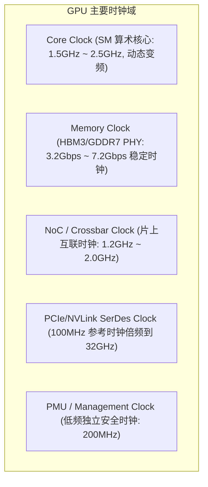

# 04 Clock、Reset 与 Power Domain 划分

## 1. 时钟域划分与跨时钟域 (CDC) 设计

GPU 内部包含多个异步时钟域，必须通过异步 FIFO 与握手逻辑进行跨时钟域信号同步：

---

## 2. 电源域 (Power Domain) 与上电时序

为降低空闲功耗，现代 GPU 设计了细粒度的电源域划分与电源门控（Power Gating）：
- **Always-On Domain (AON)**：包含 PMU、PCIe 物理待机侦听电路、温控监测传感器。
- **Logic Domain (VDD_CORE)**：包含所有 GPC、SM 和片上互联逻辑，支持毫秒级 DVFS 调压调频。
- **Memory Domain (VDD_MEM / VDDQ)**：HBM/GDDR 颗粒供电与 PHY 接口供电，要求极低的纹波噪声。
- **SRAM Retention Domain**：在计算核心休眠时维持寄存器堆和 L2 Cache 内容，避免唤醒时重新加载上下文。

> [!CAUTION]
> **原厂 Bring-up 上电约束**：上电时序必须严格遵守 `AON (3.3V/1.8V) -> PCIe PHY (0.9V) -> VDD_MEM -> VDD_CORE` 顺序。若 Core 供电早于 I/O 供电建立，极易引发 CMOS 闩锁效应（Latch-up），造成硅片物理击穿烧毁。
