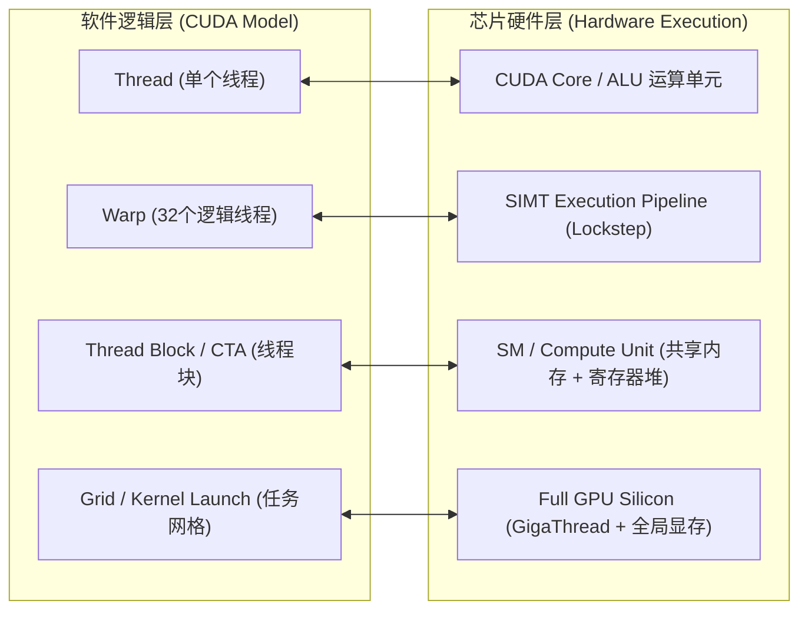

# 05 软硬件交互边界与执行模型

## 1. 软件抽象与硬件实体的映射关系

CUDA / HIP 编程模型中的逻辑概念与 GPU 芯片物理硬件存在严格的层级对应：

---

## 2. 任务下发全生命周期流转

1. **用户程序调用**：Host CPU 执行 `kernel<<<Grid, Block, SharedMem, Stream>>>(args)`。
2. **UMD 组包**：CUDA Runtime 与 UMD 将 Kernel 参数、启动配置和指令地址打包为硬件可识别的 Command Buffer（如 PushBuffer）。
3. **Ring Buffer 提交**：UMD 将指令包写入与硬件约定的 Ring Buffer，并向硬件 Doorbell 寄存器写入新尾指针。
4. **GigaThread 调度**：GPU Command Processor 抓取任务描述符，由 GigaThread Engine 依据各 SM 的寄存器和 Shared Memory 剩余容量，将 Block 动态分派给各个空闲 SM。
5. **SM 内部执行**：SM 内部的 Warp Scheduler 将 Block 拆解为多个 Warp（每 32 线程），周期性发射指令至 Tensor Core / ALU。
6. **完成与通知**：Kernel 全部 Warp 执行完毕后，硬件更新 Completion Fence，并向 Host 发出 MSI-X 中断或写回 Host Memory 标志位。
