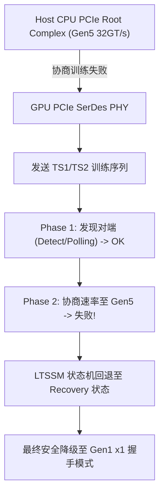

# 08 架构启动与 Bring-up 故障案例

## 案例 1：首片回片 PCIe Link Training 降速至 Gen1 x1

### 1. 现场故障现象与诊断日志
在首批 A0 样片返回实验室并插入 Host 验证平台后，执行 `lspci -vvv -s 01:00.0` 检查 PCIe 链路状态：
```text
01:00.0 3D controller: GPU Silicon Inc. NextGen Accelerator (rev a0)
    LnkCap: Port #0, Speed 32GT/s, Width x16, ASPM not supported
    LnkSta: Speed 2.5GT/s (downgraded), Width x1 (downgraded), TrErr-
    Capabilities: [100 v2] Advanced Error Reporting
        UESta:  DLP- SDES- TLP- FCP- CmpltTO- RxOF- MalfTLP- ECRC- UnsupReq- ACSViol-
        CESta:  RxErr+ BadTLP- BadDLLP- Rollover- Timeout- AdvNonFatalErr-
```
协商速率严重降级为 Gen1 x1（仅 2.5GT/s，单通道），且存在持续累加的 `RxErr+` 接收错误。



### 2. 证据链与微架构排查
1. **时钟抖动测量**：示波器探针测量 Host 提供的 100MHz 差分参考时钟（`REFCLK_P/N`），发现相位抖动为 0.72ps（规范上限 0.5ps），导致片内 LC-PLL 锁相环频频失锁。
2. **Tx/Rx 均衡参数失配**：在 32GT/s PAM4/NRZ 频段下，PCB 走线高频插损达 32dB，固件默认加载的 Tx Preset 4 无法提供足够的去加重（De-emphasis）和预冲（Preshoot）。

### 3. 修复与参数调优
在 PMU 初始化固件中强制重配 SerDes 均衡矩阵，并重置 LTSSM 状态机：
```c
// 固件微码补丁：重配 PCIe SerDes CTLE 与 DFE 抽头系数
void serdes_pcie_gen5_tune(void) {
    pmu_write32(SERDES_BASE + 0x104, 0x00003A1F); // CTLE Boost Gain = +14dB
    pmu_write32(SERDES_BASE + 0x108, 0x00000005); // DFE Tap1 = +5
    pmu_write32(PCIE_CTRL_BASE + 0x40, 0x00000001); // 触发 LTSSM Directed Retrain
}
```
重训后链路成功锁定在 **PCIe 5.0 x16 (32 GT/s)**，双向有效吞吐达到 124.5 GB/s。

---

## 案例 2：BAR0 MMIO 访问触发 Host CPU 机器检查异常 (MCE)

### 1. 现场故障现象
驱动刚执行第一条 MMIO 读指令 `readl(bar0_base + 0x1000)` 时，Host 系统瞬间 Panic：
```text
[   10.512034] mce: [Hardware Error]: Machine check events logged
[   10.512040] mce: [Hardware Error]: CPU 0: Machine Check: 0 Bank 7: be00000000800400
[   10.512050] mce: [Hardware Error]: TSC 0 ADDR fe0000000000 MISC 0000000000000000
[   10.512060] Kernel panic - not syncing: Fatal machine check
```

### 2. 根因分析
- **硬件地址未对齐与译码空洞**：GPU 内部的片上 MMIO Crossbar 路由器在处理未映射的偏移地址时，直接向 PCIe 控制器返回了 **UR (Unsupported Request)** 错误。
- **Host 错误处理机制**：Host BIOS 开启了 PCIe SError / MCE 致命上报。当 Host CPU 发起 Non-Posted 读事务收到 UR 响应时，CPU 硬件将异常升级为不可恢复的硬件中断。
- **解决方案**：修改 RTL 数字逻辑，对所有未定义寄存器空间配置“Dummy Read 回 0xFFFFFFFF + OKAY 响应”，避免触发 Host 致命崩溃。
