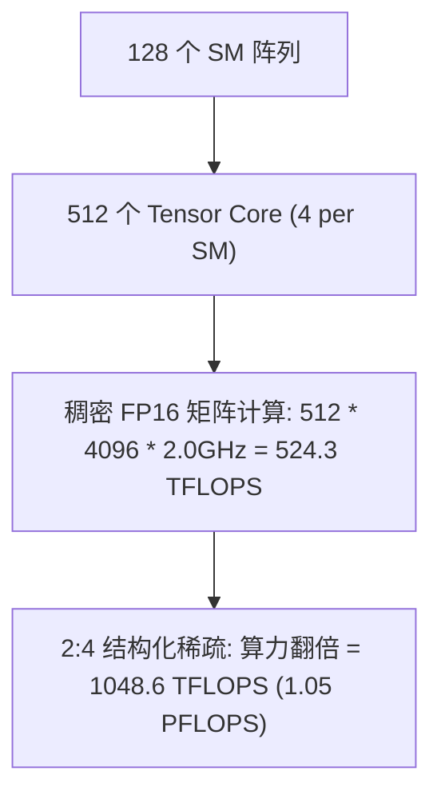
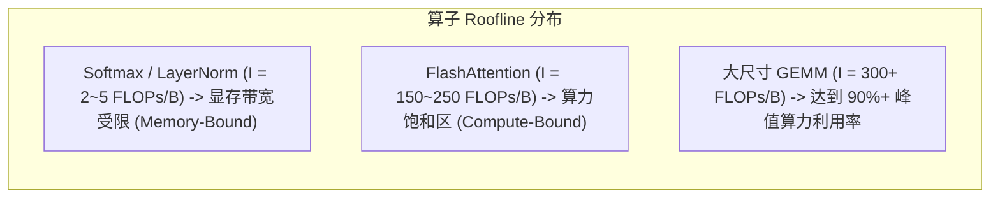

# 09 芯片算力、面积与显存带宽定量推演

## 1. 芯片峰值算力与吞吐量理论模型

现代 GPU 的理论峰值吞吐量可通过核心硬件微架构参数严格推导：

$$\text{Peak TFLOPS} = N_{SM} \times N_{TC\_per\_SM} \times \text{FLOPs\_per\_TC\_Cycle} \times f_{Core}$$

### 实例定量推演：128 SM 高性能 AI 加速 GPU
- **基础配置**：$N_{SM} = 128$ 个，工作频率 $f_{Core} = 2.0\text{ GHz}$；
- **每 SM 算力单元配置**：4 个 Tensor Core，128 个 FP32 ALU，64 个 INT32 ALU；
- **Tensor Core 周期吞吐**：每个 Tensor Core 单周期完成 $16 \times 8 \times 16$ 矩阵乘加（MMA）：
  $$\text{FLOPs/cycle/TC} = 16 \times 8 \times 16 \times 2 = 4096\text{ FLOPs (FP16/BF16)}$$



---

## 2. 显存系统物理带宽与平衡算术强度推导

设该芯片搭载 6 颗 3D TSV HBM3 颗粒：
- **物理接口位宽**：$6 \times 1024\text{-bit} = 6144\text{-bit}$；
- **物理传输速率**：$6.4\text{ Gbps}$；
- **理论显存物理带宽**：
$$B_{mem} = \frac{6144\text{ bit} \times 6.4 \times 10^9\text{ bit/s}}{8\text{ bit/Byte}} = 4.9152\text{ TB/s}$$

```text
平衡算术强度计算:
I_crit = Peak_Compute / Peak_Bandwidth
       = (524.3 * 10^12 FLOPs/s) / (4.9152 * 10^12 Bytes/s)
       = 106.67 FLOPs/Byte
```



- **工程结论**：只有当算子的计算访存比 $I \ge 106.7\text{ FLOPs/Byte}$ 时，才能完全喂饱 Tensor Core 阵列；低于此阈值的算子必须通过**算子融合（Operator Fusion）**减少显存搬运。
