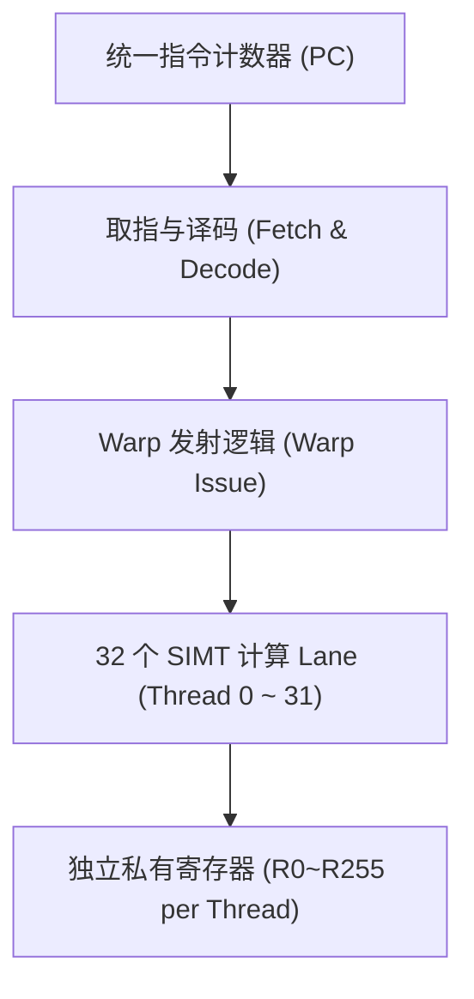

# 01 SIMT 执行模型与线程映射

## 1. SIMT 与 SIMD / MIMD 的本质区别

- **SIMD (单指令多数据)**：单个指令显式操作一个向量寄存器（如 AVX-512 的 `zmm` 寄存器 512-bit），程序员必须感知向量宽度，分支处理复杂。
- **MIMD (多指令多数据)**：每个核心拥有独立的指令指针（PC）和取指译码部件（如多核 CPU），控制灵活但硬件开销极大。
- **SIMT (单指令多线程)**：**硬件将 32 个逻辑线程聚合成一个 Warp / Wavefront**，共用同一个 PC 指针同步发射指令，但每个线程拥有独立的寄存器状态和执行上下文。硬件自动屏蔽 SIMD 矢量细节，兼具高算力密度与灵活编程接口。

---

## 2. 线程层次在硬件上的映射与驻留

| 逻辑概念 (CUDA) | 硬件承载实体 | 调度/并发粒度 | 硬件资源约束 |
| :--- | :--- | :--- | :--- |
| **Thread** | SIMT Core 中的单个 Lane | 周期级执行指令 | 独立寄存器（每线程 32~255 个 32-bit 寄存器） |
| **Warp** | 32 个 Lockstep 执行的 Threads | 硬件发射的基本调度单元 | 共享同一个 PC 与 Active Mask |
| **Thread Block (CTA)** | 单个 SM 物理核心 | 逻辑上共享资源分配 | 受限于 SM 寄存器堆总量 (64K) 与 Shared Mem (228KB) |
| **Grid** | 全芯片所有 SM | 异步宏观任务分派 | 受限于芯片总 SM 数与全局显存带宽 |
