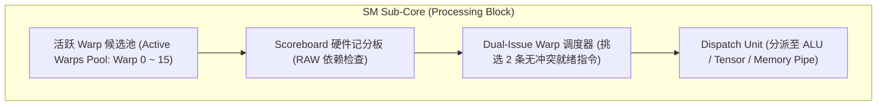
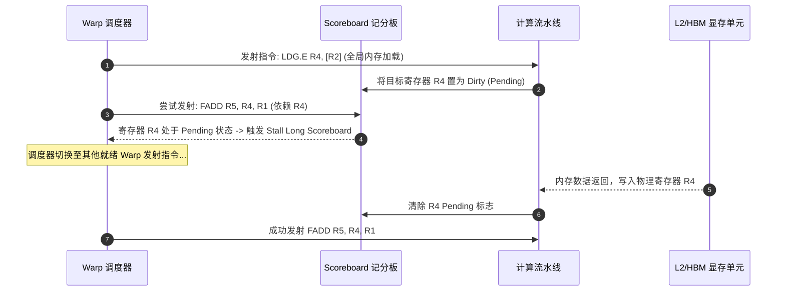

# 02 Warp 硬件调度器与 Scoreboard 依赖控制

## 1. Warp 调度器微架构与延迟隐藏 (Latency Hiding)

现代 GPU 的 SM 内部划分为 4 个物理 Sub-Core（Processing Block）。每个 Sub-Core 配备独立的 Dual-Issue Warp 调度器，管理多达 8~16 个活跃 Warp：

### 1. 零开销上下文轮转 (Zero-Overhead Context Switching)
- **CPU 乱序执行的代价**：乱序重排序缓冲（ROB）、保留站（Reservation Station）与复杂重命名寄存器消耗了巨大的芯片面积与功耗。
- **GPU 吞吐设计**：硬件将每个活跃 Warp 的寄存器状态直接常驻在片上物理寄存器堆中。当 Warp 0 遇到全局显存 Load 产生长延迟阻塞（~400 cycles）时，调度器在**单个时钟周期内无缝切换至 Warp 1、Warp 2 发射计算指令**，实现硬件级的零开销延迟隐藏。

---

## 2. Scoreboard 依赖追踪与流水线暂停 (Warp Stall)

GPU 硬件通过记分板（Scoreboard）精确追踪操作数依赖：

### 核心 Warp Stall 指标归因表

| Stall 原因分类 | 对应微架构事件 | 根因剖析 | 推荐工程优化手段 |
| :--- | :--- | :--- | :--- |
| **`Stall Long Scoreboard`** | 等待全局显存/L2 数据加载 | 显存读取延迟高、未命中 L2 Cache | 增加数据预取、提升 Tiling 块大小、增大线程并发度 |
| **`Stall Short Scoreboard`** | 等待 Shared Memory / MIO 读返回 | 共享内存 Bank 冲突或局部 RAW 依赖 | 消除 Bank 冲突、调整指令发射顺序展开循环（ILP） |
| **`Stall Barrier`** | Warp 阻塞在 `__syncthreads()` | Thread Block 内部线程负载不均衡 | 减少不必要的同步屏障、拆分轻量级 Sub-Warp 同步 |
| **`Stall Not Selected`** | Warp 已就绪但未能抢占发射槽 | 发射槽位受限或双发射冲突 | 优化混合指令发射配比（如 FP32 + INT32 混合发射） |
