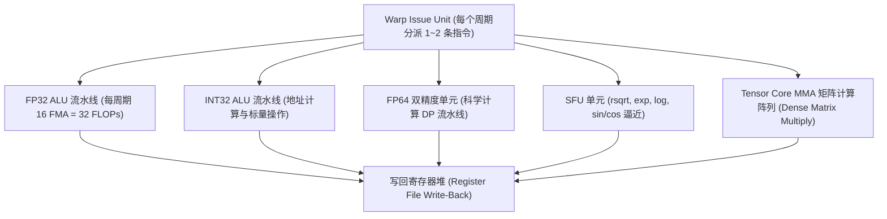
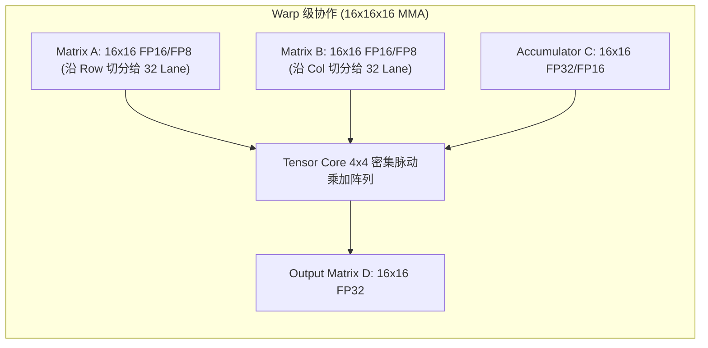

# 04 ALU、FPU 与 Tensor Core 微架构

## 1. 混合计算流水线构成与吞吐量

现代 SM 内部集成了多种异构计算流水线，由 Warp Scheduler 按指令类型发射到不同物理流水线上：

---

## 2. Tensor Core 硬件矩阵乘架构 (以 4 代 MMA 为例)

Tensor Core 突破了传统的 SIMT 标量发射，单个指令即可让整个 Warp 协同完成一个小矩阵乘法：
$$D = A \times B + C$$

Tensor Core 的算力密度达到传统 FP32 ALU 的 8~16 倍，是现代 LLM 训练与推理最核心的算力来源。
