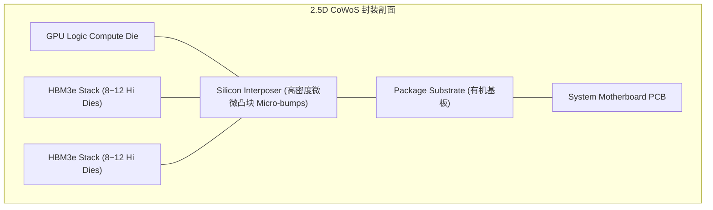

# 01 HBM3e 与 GDDR7 显存物理层架构

## 1. HBM (High Bandwidth Memory) vs GDDR 物理架构对比

| 维度 | HBM3 / HBM3e (用于 AI/数据中心 GPU) | GDDR6X / GDDR7 (用于客户端/工作站 GPU) |
| :--- | :--- | :--- |
| **物理形态** | 3D TSV 硅通孔垂直堆叠 Die + 2.5D 硅中介层 (Interposer) | PCB 板级贴片封装 (BGA) |
| **位宽 (Bus Width)** | **1024-bit per Stack** (6~8 Stack 构成 6144~8192-bit) | **32-bit per Chip** (384-bit 典型位宽) |
| **传输速率与带宽** | 6.4 Gbps ~ 9.6 Gbps，**总带宽高达 3.35 TB/s ~ 8.0 TB/s** | 24 Gbps ~ 32 Gbps PAM3，总带宽约 1.0 ~ 1.5 TB/s |
| **能效比 (pJ/bit)** | 极高 (约 3~5 pJ/bit)，适合百瓦级超算芯片 | 中等 (约 8~12 pJ/bit)，受限板级走线衰减 |
| **制造复杂度** | 极高，依赖 TSMC CoWoS 或 Intel EMIB 高级封装 | 成熟 PCB 表面贴装工艺 |

