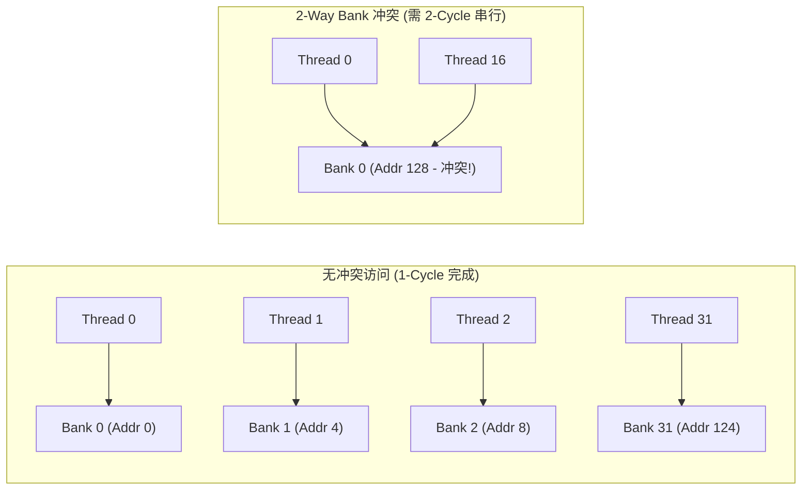

# 03 Shared Memory 32-Bank 冲突消除与访存合并

## 1. Shared Memory 32-Bank 冲突原理

Shared Memory 物理上被均匀切分为 **32 个独立访问的 Bank**（每个 Bank 宽度为 4 字节/32-bit）：
$$	ext{Bank Index} = \left(rac{	ext{Byte Address}}{4}
ight) \pmod{32}$$

- **无冲突（Zero-Conflict）**：Warp 内 32 个线程在同一周期访问 32 个不同的 Bank，或多个线程访问同一个 Bank 内的**同一物理地址（触发广播机制 Broadcast）**，硬件在 1 个周期内完成。
- **Bank 冲突（Bank Conflict）**：Warp 内多个线程访问**同一个 Bank 内的不同地址**，硬件必须将访问**串行化（Serialization）**，导致有效带宽骤降为 $rac{1}{N}$（$N$ 为最大冲突路数）。

---

## 2. Global Memory 访存合并 (Memory Coalescing)

当 Warp 内 32 个线程向全局显存（Global Memory）发出 Load/Store 请求时：
- **合并访问（Coalesced）**：若 32 个线程访问的地址连续且对齐在 32/64/128 字节边界上，GPU 内存控制器将 32 次离散访问合并为**单次 128-byte Cache Line 事务**。
- **非对齐/离散访问（Uncoalesced）**：若地址严重跨界或离散分布，硬件可能需要拆分为 32 次独立的 32-byte 事务，显存有效带宽浪费率高达 87.5% 以上。
