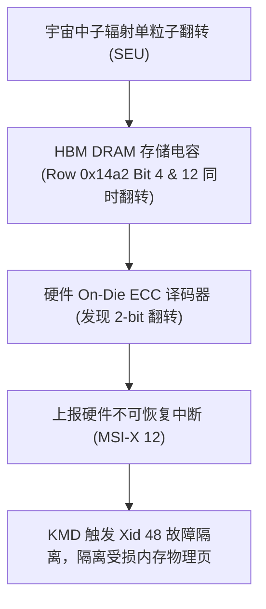

# 06 显存系统故障案例与 Bank 冲突现场排查

## 案例 1：HBM3 双比特不可纠正 ECC 错误导致训练中断 (Xid 48)

### 1. 现场故障现象与诊断日志
在千卡 LLM 训练集群连续运行 48 小时后，Worker 128 节点突然中断并记录系统错误：
```text
NVRM: Xid (PCI:0000:41:00): 48, pid=14092, DBE (Double Bit Error) on HBM memory sub-channel 3, bank 5, row 0x14a2
NVRM: ECC uncorrectable error detected at physical address 0x00001f42a000
kernel: [ 18420.124] gpu 0000:41:00.0: [drm:amdgpu_ras_error_status] Uncorrectable ECC error detected
```



### 2. 诊断排查与行重映射修复
1. 提取物理坏行坐标：`Sub-channel 3, Bank 5, Row 0x14a2`；
2. 执行动态行重映射指令：
   ```bash
   nvidia-smi --gpu-reset-row-remap -i 2
   ```
3. 驱动与固件交互，将物理坏行映射至该 Bank 预留的备用行（Spare Rows），重置后通过全容量读写测试，单卡恢复正常。

---

## 案例 2：Shared Memory 32-Way Bank 冲突导致算子性能下降 94%

### 1. 现场故障代码与 Profile
```cuda
// 存在严重 32-Way Bank Conflict 的转置内核
__shared__ float tile[32][32];
// 写入时连续无冲突: threadIdx.x 访问 Bank (0~31)
tile[threadIdx.y][threadIdx.x] = input[...]; 
__syncthreads();
// 读取时按列读取: 所有 32 个线程的 threadIdx.x=0，全部访问 Bank 0 的不同行！
float val = tile[threadIdx.x][threadIdx.y]; 
```
NSight Compute 分析输出：
- `smsp__sass_average_data_pipe_lsu_cycles_active`：活跃周期暴增 32 倍；
- `l1tex__data_pipe_lsu_wavefronts_per_instruction`：单条 LDS 指令被硬件拆解为 **32 次串行执行**，带宽利用率降至 3.125%。

### 2. 修复代码与验证
```cuda
// 增加 1 列 Padding 消除冲突: 每一行错开 1 个 Bank
__shared__ float tile_pad[32][33];
tile_pad[threadIdx.y][threadIdx.x] = input[...];
__syncthreads();
float val_opt = tile_pad[threadIdx.x][threadIdx.y]; // 32 线程单周期无冲突读取
```
重构后该内核执行时间由 $480\mu s$ 直降至 $16.2\mu s$（性能提升 **29.6 倍**）。
