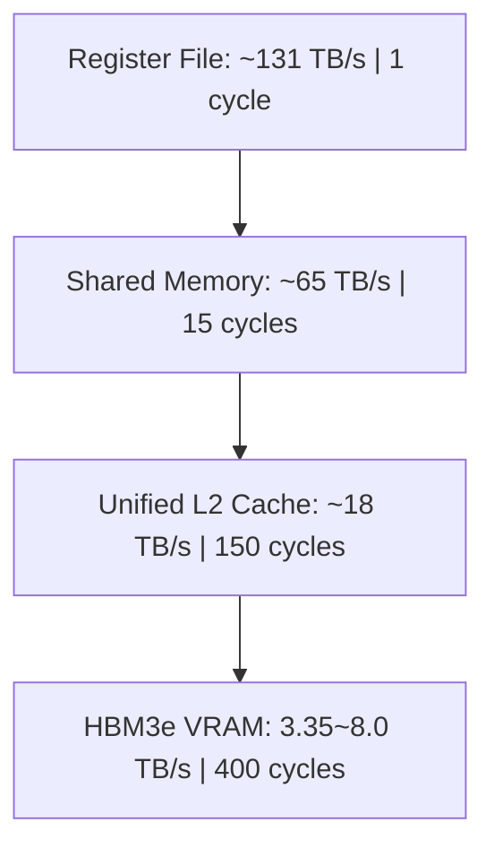

# 07 显存层级容量、时延与 Bank 冲突定量计算

## 1. 存储层级金字塔容量、延迟与带宽定量表

| 存储层次 | 物理介质 | 单 SM 容量 | 全芯片总容量 | 访问延迟 (Cycles) | 聚合总带宽 (TB/s) |
| :--- | :--- | :--- | :--- | :--- | :--- |
| **Register File** | 8T 高速 SRAM | 256 KB (64K 寄存器) | 32.7 MB | 1 cycle | **131.0 TB/s** |
| **Shared Memory** | 6T 双端口 SRAM | 160 ~ 228 KB (动态可配) | 29.1 MB | ~15 cycles | **65.5 TB/s** |
| **L1 Data Cache** | 6T 硬件 Cache | 28 ~ 96 KB | 12.2 MB | ~18 cycles | **45.0 TB/s** |
| **L2 Unified Cache**| 6T 高密度 SRAM 切片 | 全局共享切片 | 60 ~ 256 MB | ~150 cycles | **18.4 TB/s** |
| **HBM3e VRAM** | 3D TSV DRAM 堆叠 | 板载显存 | 80 ~ 144 GB | ~400 cycles | **3.35 ~ 8.0 TB/s** |

---

## 2. 32-Bank 冲突与访存合并数学模型

### 1. Shared Memory Bank 映射方程
$$\text{Bank ID} = \left(\frac{\text{Byte Address}}{4}\right) \pmod{32}$$
设一个 Warp 内 32 个线程发出的字节地址为 $A_0, A_1, \dots, A_{31}$：
- 若 $\forall i \ne j, \text{Bank}(A_i) \ne \text{Bank}(A_j)$，冲突度 $K=1$，发射周期数 $N_{cycles} = 1$；
- 若最大重合 Bank 数量为 $K$ 且访问地址互不相同，硬件必须串行发射 $K$ 次，有效吞吐量为 $\frac{1}{K}$。

### 2. 全局显存访存合并 (Memory Coalescing) 效率
设 32 个线程的访存跨度覆盖的 Cache Line 数量为 $M$（每 Cache Line 128 Bytes）：
$$\text{Bus Transaction Count} = M$$
$$\text{有效带宽利用率} = \frac{32 \times \text{Sizeof(Data)}}{M \times 128\text{ Bytes}}$$
- 当 32 个线程连续读取 4 字节数据时（覆盖 1 个 128B Line），$M=1$，带宽利用率为 $\frac{128}{128} = 100\%$；
- 当跨步读取（如 Stride = 32 浮点数，跨度覆盖 32 个不同的 Cache Line），$M=32$，带宽利用率骤降至 $\frac{128}{32 \times 128} = 3.125\%$。
