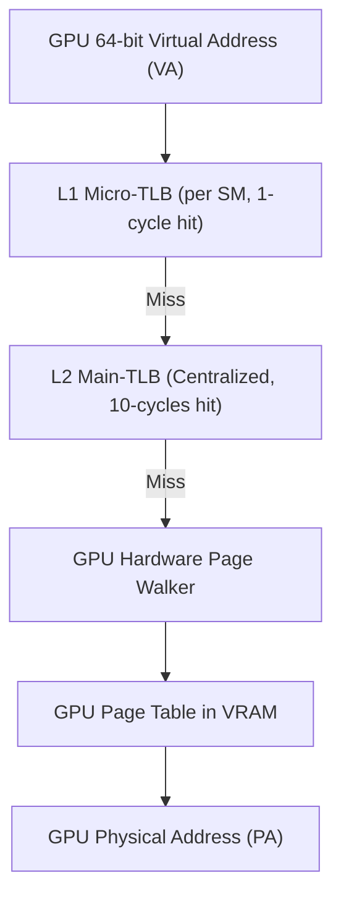

# 01 GPU MMU 与多级 TLB 硬件微架构

## 1. GPU 虚拟地址空间与页表层次

现代 64-bit GPU 内部拥有完全独立的硬件 MMU 单元，支持 48-bit 或 57-bit 虚拟地址空间：
- **页表结构**：通常采用类似 CPU 的 4 级/5 级页表（如 PML4/PML5 或 4-Level Radix Tree），基地址由 GPU MMU Page Table Base Register 存储。
- **大页支持**：支持 4KB（标准页）、64KB / 2MB（大页，Huge Pages）以及 1GB / 2MB 巨页，大幅降低 TLB Miss 率。

