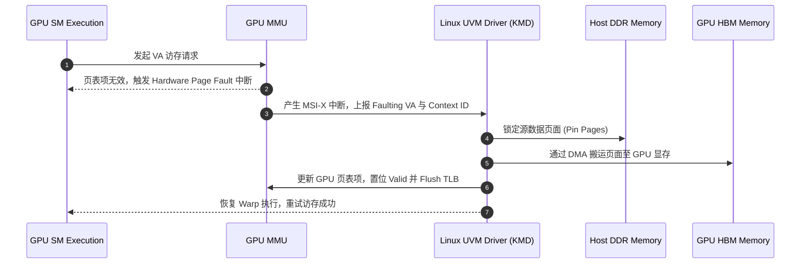

# 02 统一内存 (UVM) 与硬件 Page Fault 机制

## 1. Unified Virtual Memory (UVM) 原理

统一内存允许 CPU 与 GPU 共享相同的单指针虚拟地址空间（`cudaMallocManaged`）：
- 程序无需显式执行 `cudaMemcpy`。
- 数据可以在 CPU 主存（Host DDR）与 GPU 显存（Device HBM）之间按需动态迁移。

