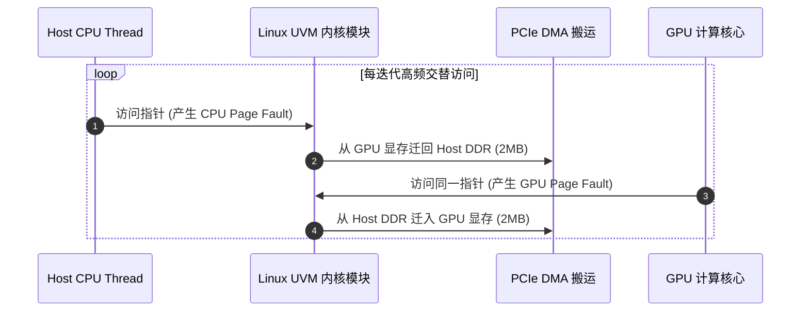

# 05 UVM 缺页风暴与 GPU MMU Fault 现场定位

## 案例 1：UVM 动态乒乓迁移引发系统缺页风暴

### 1. 现场故障现象
在基于 `cudaMallocManaged` 统一内存的医学图像处理程序中，程序吞吐仅有预期性能的 2%，`top` 显示内核进程 `kworker/u:uvm` 占用 CPU 100% 算力，`dmesg` 日志每秒输出数万行：
```text
[  120.401] [UVM] CPU page fault at 0x7f4a20000000, migrating 2MB from GPU to Host...
[  120.402] [UVM] GPU page fault at 0x7f4a20000000, migrating 2MB from Host to GPU...
[  120.403] [UVM] CPU page fault at 0x7f4a20000000, migrating 2MB from GPU to Host...
```



### 2. 根因剖析与解决
- **根因**：程序在 CPU 上更新配置参数，随后在 GPU 上计算，两者交替读写同一块未经区域隔离的统一内存，引发 2MB 大页在 PCIe 5.0 总线上来回无效搬运。
- **优化方案**：使用 `cudaMemAdvise` 对只读参数配置 `cudaMemAdviseSetReadMostly`（硬件在 CPU 与 GPU 显存各自保留只读副本），并在训练前调用 `cudaMemPrefetchAsync` 预取，消除了 100% 的运行时缺页中断。
