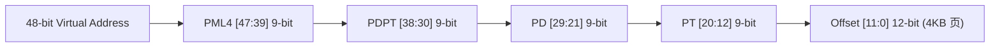

# 06 GPU 页表层级与 TLB 命中率定量推演

## 1. GPU 4-Level 虚拟页表空间结构推导

GPU 采用 48-bit 虚拟地址空间与 4 级页表（类似 CPU x86-64 PML4 架构）：

### 页表查找内存访问开销
- 当发生 **TLB Miss** 时，GPU 硬件 Page Walker 必须通过 Crossbar 访问显存中存储的 4 级页表，完成 4 次串行内存读取：
$$T_{walk} \approx 4 \times T_{DRAM} = 4 \times 400\text{ cycles} = 1600\text{ cycles}$$
- 若不使用大页，这 1600 个时钟周期的延迟将导致所有依赖该数据的 Warp 陷入长达数百周期的停顿。

---

## 2. 2MB 大页与 4KB 标准页 TLB 覆盖率对比

| 页大小 (Page Size) | 单 SM Micro-TLB 规格 (Entries) | 硬件 TLB 最大覆盖内存范围 | 大模型 70B 权重 TLB 命中率 |
| :--- | :--- | :--- | :--- |
| **4 KB** | 128 项 | $128 \times 4\text{ KB} = 512\text{ KB}$ | **< 35%** (严重颠簸) |
| **64 KB** | 128 项 | $128 \times 64\text{ KB} = 8\text{ MB}$ | **~75%** |
| **2 MB (Huge Page)** | 128 项 | $128 \times 2\text{ MB} = \mathbf{256\text{ MB}}$ | **> 99.8%** (近乎 100% 命中) |

- **原厂工程实践**：GPU 驱动内存分配器（`cuMemAlloc`）默认以 2MB 对齐分配物理页框，确保大模型张量在全芯片执行时 TLB Miss 率小于 0.2%。
