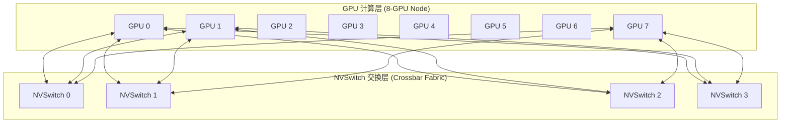

# 03 NVSwitch 交换架构与超节点拓扑

## 1. 8-GPU Full-Mesh 与 NVSwitch 架构

在 8 卡服务器内部，若采用全互联（Full-Mesh），需要 $8 	imes 7 / 2 = 28$ 组点对点链路，布线极其复杂。
- **NVSwitch 解决方案**：引入独立的 NVSwitch 交换芯片（单芯片具备数十个 NVLink 端口与几 TB/s 交叉交换能力）。
- **拓扑结构**：8 颗 GPU 均直接连接至 4~6 颗 NVSwitch 芯片，构成无阻塞的 **Crossbar 胖树（Fat-Tree）网络**，实现任意卡间等带宽、单跳（Single-Hop）超低延迟直连。

