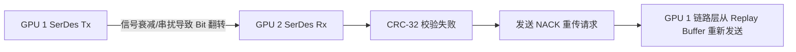

# 05 高速互联链路协商失败与 CRC 错误排查

## 案例 1：NVLink 链路 CRC 错误暴增导致通信吞吐断崖

### 1. 现象与诊断
8 卡训练节点在运行 AllReduce 集合通信时，卡 1 到 卡 2 的通信带宽仅有 45 GB/s（正常值为 450 GB/s）。
执行 `nvidia-smi nvlink -e -i 1` 输出：
```text
GPU 1 NVLink Error Status:
  Link 0: DL Recovery Errors: 24890, DL CRC Errors: 189201, Replay Count: 589210
  Link 1: DL Recovery Errors: 0,     DL CRC Errors: 0,      Replay Count: 0
```



### 2. 根因剖析与硬件排查
1. **链路层硬件重传风暴（Replay Storm）**：NVLink 数据链路层在校验到 CRC 错误时，硬件自动触发 Replay 重发机制。由于误码率（BER）高达 $10^{-4}$，总线带宽几乎全部被重传数据包与 ACK/NACK 握手吞噬。
2. **物理层根因**：使用力矩扳手检查 NVLink 背板连接器，发现卡 1 对应端子的紧固力矩仅为 0.2 N·m（标准为 0.45 N·m），导致高速差分引脚发生微米级接触不良。
3. **修复**：按标准力矩紧固连接器后，BER 恢复至 $<10^{-15}$，CRC 错误归零，链路带宽恢复至 450 GB/s。
