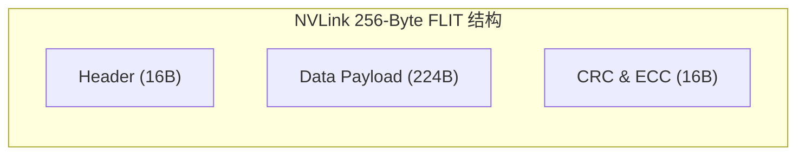

# 06 NVLink 传输开销与有效带宽推导

## 1. NVLink4 数据链路层封包效率与理论模型

NVLink4 采用 256-byte 定长 FLIT（Flow Control Unit）格式传输：
- **有效载荷 (Data Payload)**：224 Bytes；
- **协议控制开销 (Header + Link Control)**：16 Bytes；
- **硬件纠错开销 (CRC-32 + ECC)**：16 Bytes；
- **链路层有效利用率**：
$$\eta_{link} = \frac{224}{256} = 87.5\%$$

---

## 2. 8 卡 NVSwitch 胖树 (Fat-Tree) 拓扑无阻塞带宽推导

在标准 8-GPU HGX 节点中，配备 4 颗 NVSwitch 交换芯片：
- 每颗 GPU 引出 18 条 NVLink 链路（每链路双向 50 GB/s = 100 GB/s）；
- 单 GPU 双向聚合带宽：$18 \times 100\text{ GB/s} = 1.8\text{ TB/s}$；
- 8 颗 GPU 双向总吞吐：
$$\text{Total Fabric Bandwidth} = 8 \times 1.8\text{ TB/s} = 14.4\text{ TB/s}$$
- **跨卡单跳延迟推导**：
  - GPU Tx FIFO $\rightarrow$ SerDes PHY $\rightarrow$ NVSwitch Crossbar 转发 $\rightarrow$ GPU Rx FIFO；
  - 硬件固定往返时延（RTT）仅为 **$\approx 90\text{ ns}$**，比经过 CPU PCIe Switch 路径（$\approx 1.2\mu s$）降低了 13 倍。
