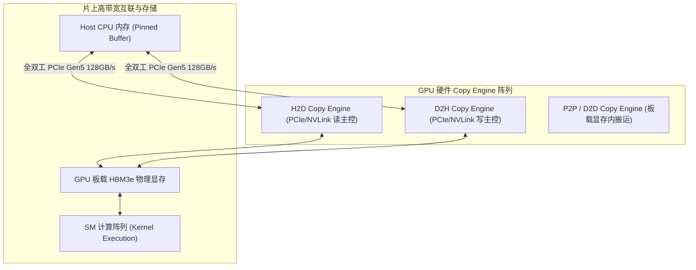

# 01 Copy Engine (DMA) 硬件微架构

## 1. GPU Copy Engine 硬件架构与三向全双工

GPU 内部集成了多个独立于 SM 算术流水线的专用 **Copy Engine (CE)**，每个 CE 拥有独立的硬件描述符解析器与 AXI 读写主控：

- **硬件三向并发（Tri-directional Concurrency）**：`Host -> Device 传输`、`Device -> Host 传输` 和 `SM 内部计算` 三者由完全解耦的硬件执行管道驱动，互不干扰，可实现 100% 异步并发。
