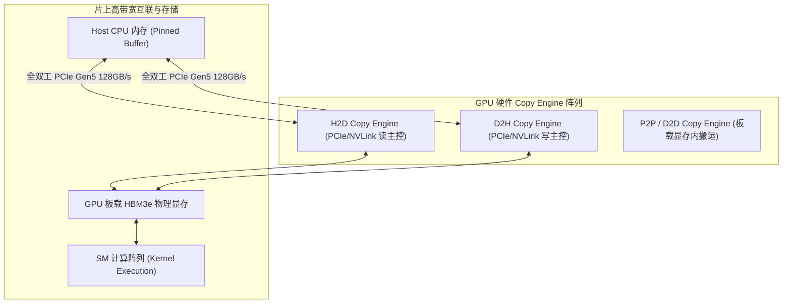

# 01 Copy Engine (DMA) 硬件微架构

## 1. GPU Copy Engine 硬件架构与三向全双工

GPU 内部集成了多个独立于 SM 算术流水线的专用 **Copy Engine (CE)**，每个 CE 拥有独立的硬件描述符解析器与 AXI 读写主控：

```mermaid
graph TB
    subgraph CopyEngines["GPU 硬件 Copy Engine 阵列"]
        CE_H2D["H2D Copy Engine (PCIe/NVLink 读主控)"]
        CE_D2H["D2H Copy Engine (PCIe/NVLink 写主控)"]
        CE_P2P["P2P / D2D Copy Engine (板载显存内搬运)"]
    end

    subgraph MemoryInterconnect["片上高带宽互联与存储"]
        HostDDR["Host CPU 内存 (Pinned Buffer)"]
        VRAM["GPU 板载 HBM3e 物理显存"]
        SM_Compute["SM 计算阵列 (Kernel Execution)"]
    end

    HostDDR <-->|全双工 PCIe Gen5 128GB/s| CE_H2D & CE_D2H
    CE_H2D & CE_D2H <--> VRAM
    VRAM <--> SM_Compute
```

- **硬件三向并发（Tri-directional Concurrency）**：`Host -> Device 传输`、`Device -> Host 传输` 和 `SM 内部计算` 可以使用不同执行引擎重叠运行，但仍可能争用互联与显存带宽。能否并发还受设备能力、Pinned Host Buffer、Stream 和依赖关系限制，需要用时间线确认。

参考：[CUDA 异步执行与并发条件](https://docs.nvidia.com/cuda/cuda-programming-guide/02-basics/asynchronous-execution.html)。
