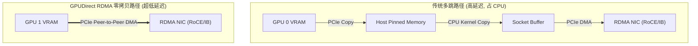

# 02 GPUDirect RDMA 与 GPUDirect Storage 零拷贝技术

## 1. 传统路径 vs GPUDirect RDMA 路径对比

- **GPUDirect RDMA 核心机制**：
  - GPU 驱动向 RDMA 网卡驱动暴露 GPU 显存物理页（BAR1 映射）。
  - RDMA 网卡直接通过 PCIe Switch 发起 P2P DMA 读写 GPU 显存，**完全绕过 Host CPU 内存与 CPU 中断参与**，通信延迟由微秒级直降至几百纳秒。
