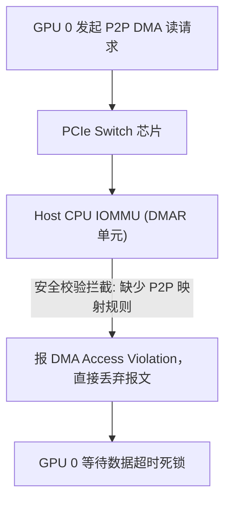

# 05 GPUDirect RDMA 死锁与 DMA 同步故障案例

## 案例 1：Linux IOMMU 阻断 PCIe P2P 事务导致跨卡通信卡死

### 1. 现场故障现象
在开启 GPUDirect RDMA 的多机训练集群中，初始化 NCCL 时进程持续挂起：
```text
NCCL WARN: Failed to initialize P2P between dev 0 and dev 1: error code 0x1d (Invalid Argument)
dmesg: [  512.124] DMAR: [DMA Read] Request device [01:00.0] PASID 0 address 0x3f80000000 flags 0x0
dmesg: [  512.125] DMAR: ERROR: DMA Access Violation - Page Not Present
```



### 2. 根因剖析与修复方案
- **根因**：Host Linux 系统默认开启了严格的 IOMMU DMA 重映射（`intel_iommu=on`），但未声明 PCIe 设备的直通透传（Pass-Through），导致 PCIe Switch 收到来自 GPU 0 的 TLP 目标地址为 GPU 1 BAR 空间时被 IOMMU 误拦截。
- **修复措施**：
  1. 在 Linux 内核启动参数中增加：`intel_iommu=on iommu=pt`；
  2. 确认加载 `nvidia-peermem` 内核驱动模块；
  3. 重新测试，跨卡 P2P 读写吞吐达到 PCIe 5.0 x16 满速（125 GB/s）。
