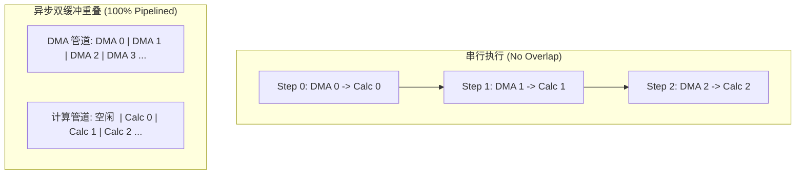

# 06 Copy Engine 与计算重叠效率定量推导

## 1. 异步数据搬运与计算双缓冲（Double Buffering）数学模型

设大批次任务包含 $N$ 个数据块，单块数据通过 PCIe 传输时间为 $T_{DMA}$，GPU SM 算力执行耗时为 $T_{Compute}$：

### 1. 耗时推导公式
- **串行执行总耗时**：
  $$T_{Serial} = N \times (T_{DMA} + T_{Compute})$$
- **双缓冲完全重叠总耗时**：
  $$T_{Overlap} = T_{DMA} + (N-1) \times \max(T_{DMA}, T_{Compute}) + T_{Compute}$$
- **加速比（Speedup）**：
  $$\text{Speedup} = \frac{N \times (T_{DMA} + T_{Compute})}{T_{DMA} + (N-1) \times \max(T_{DMA}, T_{Compute}) + T_{Compute}} \xrightarrow{N \to \infty} \frac{T_{DMA} + T_{Compute}}{\max(T_{DMA}, T_{Compute})}$$

### 2. 实例定量计算
- 设单块数据 $T_{DMA} = 10\text{ ms}$（传输 1.2GB 数据），$T_{Compute} = 12\text{ ms}$，$N = 1000$ 个 Iteration：
  - 串行耗时：$1000 \times (10 + 12) = 22,000\text{ ms} = 22\text{ s}$；
  - 双缓冲耗时：$10 + 999 \times 12 + 12 = 12,010\text{ ms} = 12.01\text{ s}$；
  - **实际加速比**：$\frac{22}{12.01} = \mathbf{1.832\times}$（整体性能提升 **83.2%**）。
