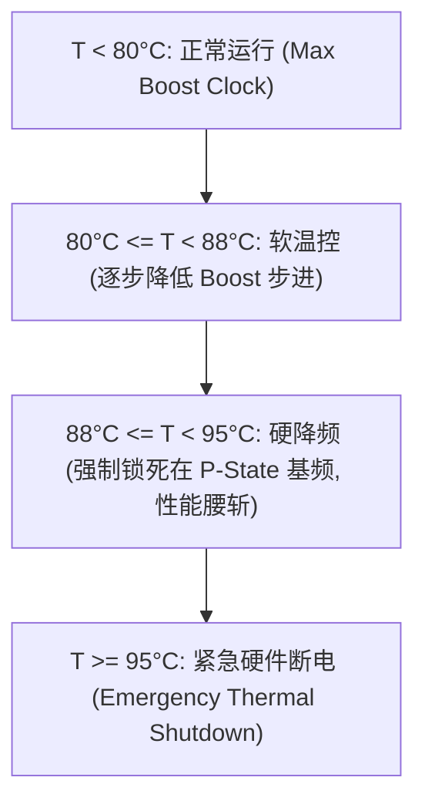

# 02 Thermal Throttling 机制与片上温度传感器

## 1. 片上温度传感器阵列 (Thermal Diodes)

由于大尺寸芯片存在明显的局部热点（Hotspot，例如 Tensor Core 阵列或 NoC 交叉中心），芯片内部通常布设数十个高精度热敏二极管：
- **采样周期**：微秒级实时采样，并由 PMU 硬件实时聚合计算 $T_{hotspot}$ 与 $T_{edge}$。

---

## 2. 阶梯式降频保护机制 (Thermal Throttling)

