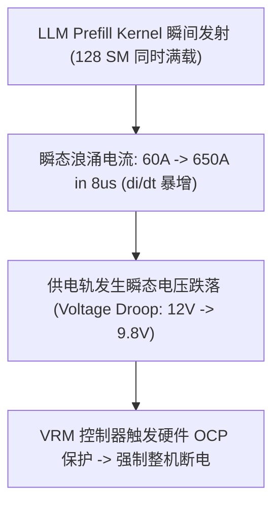

# 05 瞬态浪涌电流掉电与过温降频故障案例

## 案例 1：LLM Prefill 阶段瞬态 $di/dt$ 导致主板过流保护（OCP）跳闸

### 1. 现场故障现象
大模型推理高并发业务启动时，单机 8 卡服务器发生整机突然断电重启。
示波器抓取 12V VRM 供电引脚波形：
- 在 Kernel Launch 后的 $8\mu s$ 内，供电电流由 $60\text{ A}$ 瞬态飙升至 $650\text{ A}$（变化率 $di/dt \approx 73.75\text{ A/}\mu\text{s}$）；
- 触发主板数字电源控制器（VRM Controller）的硬件级 **OCP（Over-Current Protection）**，切断了 12V 供电。

### 2. 根因剖析与固件修复
- **根因**：没有阶梯式时钟升频缓冲，全芯片数万个 MAC 单元在同一周期翻转产生巨大电流冲击。
- **修复方案**：在 PMU 固件中引入 **Clock Ramping（阶梯升频）** 策略：
  - 在 Kernel 启动的前 $15\mu s$ 内，将 Core Clock 分 8 步逐渐提升（800MHz $\rightarrow$ 1.2GHz $\rightarrow$ 1.6GHz $\rightarrow$ 2.0GHz）；
  - 将 $di/dt$ 峰值限制在 $< 15\text{ A/}\mu\text{s}$，电压跌落幅度控制在 $<3\%$，彻底解决断电问题。
