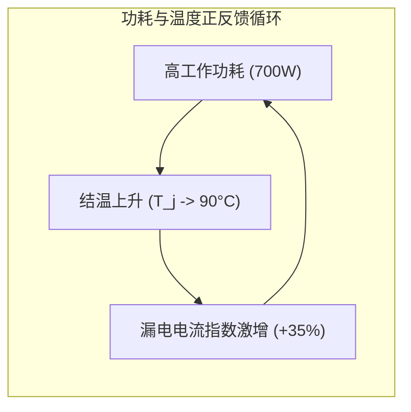

# 06 DVFS 功耗、能效比与热阻定量模型

## 1. 芯片总功耗与结温（Junction Temperature）耦合模型

$$\begin{cases}
P_{total}(V, f, T_j) = \alpha C V^2 f + V \times I_0 \cdot \exp\left(\frac{q(V - V_0)}{k T_j}\right) \\
T_j = T_{ambient} + P_{total} \times \theta_{ja}
\end{cases}$$

- $\theta_{ja}$：芯片硅片到环境空气的总热阻（典型风冷 $\approx 0.12\text{ °C/W}$，先进液冷 $\approx 0.04\text{ °C/W}$）。

---

## 2. P-States 调频调压节能定量对比

| P-State 档位 | 核心频率 (GHz) | 供电电压 (V) | 动态功耗 (W) | 静态漏电 (W) | 总功耗 (W) | 适用场景 |
| :--- | :--- | :--- | :--- | :--- | :--- | :--- |
| **P0 (Max Boost)** | 2.1 GHz | 0.95 V | 580 W | 120 W | **700 W** | LLM 训练与密集推理 |
| **P2 (Balanced)** | 1.5 GHz | 0.80 V | 290 W | 60 W | **350 W** | 批处理轻载渲染 (能效比最优) |
| **P8 (Idle)** | 0.3 GHz | 0.65 V | 15 W | 15 W | **30 W** | 桌面待机与轻量显示 |
