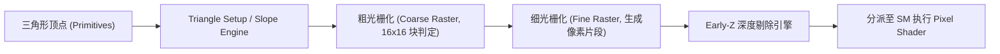

# 01 光栅化硬件流水线与 RT Core 光线追踪引擎

## 1. 硬件光栅化流水线 (Rasterization Engine)

---

## 2. RT Core (Ray Tracing Core) 硬件求交加速

光线追踪的核心算力开销在于遍历 BVH（层次包围盒）树与三角形几何求交：
- **硬件 BVH 遍历单元**：在片上由硬件状态机直接执行 BVH AABB 节点测试与子节点下钻，无需消耗 SM 的通用 ALU 算力。
- **Ray-Triangle 求交单元**：硬件单周期执行 Möller–Trumbore 光线-三角形相交计算，实现数倍于软件遍历的能效。
