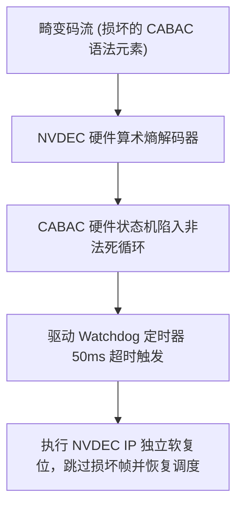

# 05 硬件编解码器死锁与显示撕裂排查案例

## 案例 1：畸变码流导致 NVDEC 硬件状态机死锁挂起

### 1. 现场故障现象
在百万路安防视频并发分析系统中，NVDEC 解码特定损坏的 H.265 码流时，进程卡死在 `cuvidDecodePicture`，占用率 100% 且无法响应系统信号：
```text
[  140.231] [drm:nvdec_watchdog] *ERROR* Engine NVDEC0 timed out on channel 12
[  140.232] [drm:nvdec_watchdog] Current PC=0x0004f210, Status=0x80000001 (BUSY_WAIT_CABAC)
```



### 2. 根因剖析与驱动修复
- **根因**：码流中存在非法的 CABAC 语法元素，导致硬件算术熵解码状态机无法解析结束标志（End-of-Slice），陷入硬件内部死循环。
- **驱动修复**：在 KMD 驱动中为 NVDEC 配置 50ms 硬件超时。一旦超时，驱动对 NVDEC 执行独立的 IP 级软复位（不影响 SM 计算核心），并向用户空间返回 `CUDA_ERROR_DECODER_TIMEOUT`。
